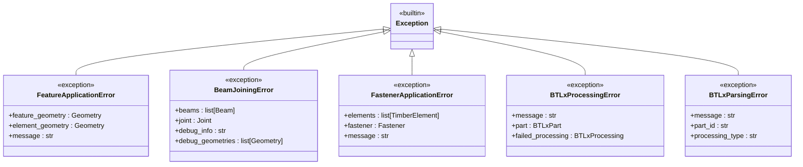

# Class Diagrams

This section provides visual representations of the class hierarchies and relationships in different subsystems of COMPAS Timber. This is to help developers better understand the codebase and to document the interface of the different classes.

The diagrams are generated from the source code (attributes, methods and inheritance are extracted with Python's `ast`), so they reflect the code at the version noted in the changelog rather than an idealized design. Members inherited from `compas` / `compas_model` base classes are not repeated on subclasses.

[TOC]

## Timber Element Subsystem

The elements subsystem contains all the core timber elements that can be modeled and manipulated. `Beam` and `Plate` inherit from the base `TimberElement` class, while `Panel`, `Fastener` and `PanelFeature` inherit directly from compas_model's `Element`. `Plate` and `Panel` delegate their outline/plane logic to a shared, composed `PlateGeometry` object. `frame` and element-tree bookkeeping are inherited from compas_model's `Element` and are not repeated below. The legacy `Feature` classes (`CutFeature`, `DrillFeature`, `MillVolume`, `BrepSubtraction`) predate the BTLx-based features; they are no longer used internally but remain exported from `compas_timber.elements` for backward compatibility.

```mermaid
classDiagram
      class Element {
         <<compas_model>>
      }

      class Data {
         <<abstract>>
      }

      class TimberElement {
         <<abstract>>
         +attributes
         +length : float
         +width : float
         +height : float
         +debug_info
         +is_beam : bool
         +is_plate : bool
         +is_group_element : bool
         +features : list[Feature]
         +geometry : Geometry
         +ref_frame
         +ref_sides
         +ref_edges
         +reset_computed_properties()
         +clear_model_dependent_cache()
         +transform(transformation)
         +remove_blank_extension()
         +reset()
         +add_feature(feature)
         +add_features(features)
         +remove_features(features=None)
         +transformation_to_local()
         +side_as_surface(side_index)
         +front_side(ref_side_index)
         +back_side(ref_side_index)
         +opp_side(ref_side_index)
         +get_dimensions_relative_to_side(ref_side_index)
      }

      class Beam {
         +shape : Box
         +blank : Box
         +blank_length : float
         +centerline : Line
         +compute_elementgeometry(include_features=True)
         +compute_aabb(inflate=0.0)
         +compute_obb(inflate=0.0)
         +compute_collision_mesh()
         +from_centerline(centerline, width, height, z_vector=None, **kwargs)
         +from_endpoints(point_start, point_end, width, height, z_vector=None, **kwargs)
         +from_box(box, **kwargs)
         +add_blank_extension(start, end, joint_key=None)
         +extension_to_plane(plane)
         +endpoint_closest_to_point(point)
      }

      class Plate {
         +plate_geometry : PlateGeometry
         +blank : Box
         +blank_length : float
         +outlines
         +outline_a : Polyline
         +outline_b : Polyline
         +thickness : float
         +planes
         +normal
         +edge_planes
         +set_extension_plane(edge_index, plane) : None
         +apply_edge_extensions() : None
         +compute_aabb(inflate=0.0) : Box
         +compute_obb(inflate=0.0) : Box
         +compute_collision_mesh() : Mesh
         +compute_elementgeometry(include_features=True) : Union[Brep, Mesh]
         +from_outlines(outline_a, outline_b, openings=None, orientation=None, **kwargs)
         +from_outline_thickness(outline, thickness, vector=None, openings=None, orientation=None, **kwargs)
         +from_face_thickness(brep, thickness, vector=None, orientation=None, **kwargs)
         +from_brep(brep, orientation=None, **kwargs)
      }

      class PlateGeometry {
         +frame : Frame
         +length : float
         +width : float
         +thickness : float
         +outline_a : Polyline
         +outline_b : Polyline
         +edge_planes : dict[int, Plane]
         +compute_aabb(inflate=0.0) : Box
         +set_extension_plane(edge_index, plane) : None
         +apply_edge_extensions() : None
         +remove_blank_extension(edge_index=None)
         +reset()
         +compute_shape() : Brep
         +from_global_outlines(outline_a, outline_b, orientation=None) : PlateGeometry
         +from_frame_and_dims(frame, length, width, thickness) : PlateGeometry
      }

      class Fastener {
         +interfaces : list
         +attributes : dict
         +debug_info : list
         +is_fastener : bool
         +key : int or None
         +clear_model_dependent_cache()
         +compute_elementgeometry()
      }

      class BallNodeFastener {
         +node_point : Point
         +ball_diameter : float
         +base_interface : FastenerTimberInterface | None
         +default_fastener_interface
         +interface_plate
         +interface_shape
         +update_interface(interface)
         +compute_geometry()
         +compute_collision_mesh()
      }

      class PlateFastener {
         +outline : list[Point]
         +thickness : float
         +frame : Frame
         +angle : float
         +topology : int or list[int]
         +cutouts : list[Polyline]
         +holes
         +shapes
         +shape
         +set_default(joint)
         +place_instances(joint)
         +get_fastener_frames(joint)
         +validate_fastener_beam_compatibility(joint)
         +add_features()
         +compute_geometry()
      }

      class FastenerTimberInterface {
         +outline_points : list[Point]
         +thickness : float
         +holes : list[dict]
         +frame : Frame
         +element : object
         +shapes : list[Geometry]
         +features : list[BTLxFromGeometryDefinition]
         +get_features(element)
      }

      class Feature {
         <<abstract>>
         +is_joinery : bool
      }

      class CutFeature {
         +cutting_plane : Frame
         +apply(element_geometry, *args, **kwargs)
         +transform(transformation)
      }

      class DrillFeature {
         +line : Line
         +diameter : float
         +length : float
         +apply(element_geometry, *args, **kwargs)
         +transform(transformation)
      }

      class MillVolume {
         +mesh_volume
         +apply(element_geometry, *args, **kwargs)
         +transform(transformation)
      }

      class BrepSubtraction {
         +volume : Brep
         +apply(element_geometry, *args, **kwargs)
         +transform(transformation)
      }

      class Panel {
         +plate_geometry : PlateGeometry
         +length : float
         +width : float
         +height : float
         +type
         +attributes
         +debug_info
         +geometry
         +outlines
         +outline_a
         +outline_b
         +thickness : float
         +planes : tuple[Plane, Plane]
         +normal : Vector
         +edge_planes : dict[int, Plane]
         +features : list[PanelFeature]
         +interfaces
         +is_group_element : bool
         +set_extension_plane(edge_index, plane)
         +apply_edge_extensions()
         +remove_blank_extension(edge_index=None)
         +clear_model_dependent_cache()
         +reset()
         +remove_features(features=None) : None
         +compute_aabb(inflate=0.0) : Box
         +compute_obb(inflate=0.0) : Box
         +compute_collision_mesh() : Mesh
         +transformation_to_local()
         +compute_elementgeometry(include_features=True) : Brep
         +from_outline_thickness(outline, thickness, vector=None, openings=None, orientation=None, **kwargs)
         +from_face_thickness(brep, thickness, vector=None, orientation=None, **kwargs)
         +from_brep(brep, orientation=None, **kwargs)
         +from_outlines(outline_a, outline_b, openings=None, recognize_doors=False, horizontal_openings=False, orientation=None, **kwargs)
      }

      class PanelType {
         <<enumeration>>
         WALL
         FLOOR
         ROOF
         GENERIC
      }

      class PanelFeature {
         <<abstract>>
         +panel_feature_type
         +is_joinery
         +geometry : Geometry
         +apply(geometry, panel) : Brep
      }

      class PanelFeatureType {
         <<enumeration>>
         CONNECTION_INTERFACE
         RECESS
         OPENING
         LINEAR
         VOLUMETRIC
         NONE
      }

      class Opening {
         +opening_type
         +outline_a
         +outline_b
         +shape
         +from_outline_panel(outline, panel, opening_type=None, project_horizontal=False, name=None)
      }

      class OpeningType {
         <<enumeration>>
         DOOR
         WINDOW
      }

      class PanelConnectionInterface {
         +edge_index
         +interface_role
         +polyline : Polyline
         +width : float
         +compute_elementgeometry(include_features=False) : Polyline
         +as_plane() : Plane
      }

      class InterfaceRole {
         <<enumeration>>
         MAIN
         CROSS
         NONE
      }

      %% Inheritance relationships
      Element <|-- TimberElement
      TimberElement <|-- Beam
      TimberElement <|-- Plate
      Data <|-- PlateGeometry
      Element <|-- Fastener
      Fastener <|-- BallNodeFastener
      Fastener <|-- PlateFastener
      Data <|-- FastenerTimberInterface
      Data <|-- Feature
      Feature <|-- CutFeature
      Feature <|-- DrillFeature
      Feature <|-- MillVolume
      Feature <|-- BrepSubtraction
      Element <|-- Panel
      Element <|-- PanelFeature
      PanelFeature <|-- Opening
      PanelFeature <|-- PanelConnectionInterface

      %% Composition and usage relationships
      Plate *-- PlateGeometry : delegates to
      Panel *-- PlateGeometry : delegates to
      Fastener o-- FastenerTimberInterface : contains
      Panel o-- PanelFeature : contains
      Panel ..> PanelType : uses
      PanelFeature ..> PanelFeatureType : uses
      Opening ..> OpeningType : uses
      PanelConnectionInterface ..> InterfaceRole : uses
```

## Connections Subsystem

The connections subsystem defines joints and their relationships. All joints inherit from the base `Joint` class (a `compas.data.Data` subclass) and declare the topology they support via `SUPPORTED_TOPOLOGY`. Joints are registered in the `TimberModel` and referenced from the edges of its interaction graph. Beam joints join two or more `Beam` elements; generic bases (`ButtJoint`, `LapJoint`, `MortiseTenonJoint`) share logic across topology-specific implementations. `CutPlaneSpec` and `MiterPlaneSpec` describe cutting planes relative to a beam's reference side (so they survive model transformations) and are passed to the butt/miter joint constructors via the `butt_plane_spec` / `back_plane_spec` / `miter_plane` parameters. Plate joints connect two `Plate` elements along their outlines; panel joints reuse the plate joint geometry logic through multiple inheritance. `JointCandidate` / `PlateJointCandidate` are placeholders registered by `TimberModel.connect_adjacent_*()`, which can later be promoted to concrete joints with `Joint.promote_joint_candidate()`.

```mermaid
classDiagram
      class Data {
         <<abstract>>
      }

      class Joint {
         <<abstract>>
         +SUPPORTED_TOPOLOGY = TOPO_UNKNOWN
         +MIN_ELEMENT_COUNT = 2
         +MAX_ELEMENT_COUNT = 2
         +elements : tuple[Element]
         +element_a
         +element_b
         +topology : JointTopology
         +location : Point
         +generated_elements : list[Element]
         +ends : dict[str, str]
         +interactions : list[tuple[Element, Element]]
         +element_count_complies(elements)
         +add_features()
         +add_extensions()
         +restore_elements_from_keys(model)
         +get_beam_direction_towards_joint(beam) : Vector
         +create(model, *elements, **kwargs)
         +promote_cluster(model, cluster, reordered_elements=None, **kwargs)
         +promote_joint_candidate(model, candidate, reordered_elements=None, **kwargs)
         +check_elements_compatibility(elements, raise_error=False)
      }

      class JointCandidate {
         +distance : float | None
      }

      class CutPlaneSpec {
         +ref_side_index
         +angle
         +offset
         +to_plane(beam) : Plane
         +from_butt_plane(main_beam, cross_beam, plane) : CutPlaneSpec
         +from_back_plane(main_beam, cross_beam, plane) : CutPlaneSpec
      }

      class MiterPlaneSpec {
         +ref_side_index
         +angle_x
         +angle_y
         +offset
         +to_plane(beam) : Plane
         +from_plane(beam_a, beam_b, plane) : MiterPlaneSpec
      }

      class ButtJoint {
         +SUPPORTED_TOPOLOGY = TOPO_L
         +mill_depth : float
         +force_pocket : bool
         +conical_tool : bool
         +features : list[BTLxProcessing]
         +main_beam : Beam
         +cross_beam : Beam
         +beams : list[Beam]
         +cross_beam_ref_side_index : int
         +main_beam_ref_side_index : int
         +butt_plane : Plane
      }

      class LButtJoint {
         +SUPPORTED_TOPOLOGY = TOPO_L
         +modify_cross : bool
         +reject_i : bool
         +back_plane : Plane
         +create(model, main_beam=None, cross_beam=None, small_beam_butts=False, **kwargs)
      }

      class TButtJoint {
         +SUPPORTED_TOPOLOGY = TOPO_T
         +fasteners
         +base_fastener
      }

      class YButtJoint {
         +SUPPORTED_TOPOLOGY = TOPO_Y
         +MIN_ELEMENT_COUNT = 3
         +MAX_ELEMENT_COUNT = 3
         +mill_depth : float
         +features
         +beams
         +cross_beams : Beam
         +main_beam : Beam
         +cross_beam_a : Beam
         +cross_beam_b : Beam
         +cross_beam_ref_side_index(beam)
         +main_beam_ref_side_index(beam)
         +get_miter_planes(beam_a, beam_b)
      }

      class TBirdsmouthJoint {
         +SUPPORTED_TOPOLOGY = TOPO_T
         +mill_depth : float
         +features
         +main_beam : Beam
         +cross_beam : Beam
         +cross_ref_side_indices
      }

      class LMiterJoint {
         +SUPPORTED_TOPOLOGY = TOPO_L
         +ref_side_miter : bool
         +cutoff : bool
         +clean : bool
         +features
         +beam_a : Beam
         +beam_b : Beam
         +cutting_planes
         +miter_plane : MiterPlaneSpec
         +miter_plane_args(beam_a, beam_b, miter_plane) : dict
      }

      class LapJoint {
         <<abstract>>
         +flip_lap_side : bool
         +cut_plane_bias
         +features
         +beam_a : Beam
         +beam_b : Beam
         +ref_side_index_a
         +ref_side_index_b
         +cutting_plane_a
         +cutting_plane_b
      }

      class TLapJoint {
         +SUPPORTED_TOPOLOGY = TOPO_T
         +main_beam : Beam
         +cross_beam : Beam
      }

      class LLapJoint {
         +SUPPORTED_TOPOLOGY = TOPO_L
      }

      class XLapJoint {
         +SUPPORTED_TOPOLOGY = TOPO_X
      }

      class LFrenchRidgeLapJoint {
         +SUPPORTED_TOPOLOGY = TOPO_L
         +drillhole_diam : float
      }

      class BallNodeJoint {
         +SUPPORTED_TOPOLOGY = TOPO_Y
         +MAX_ELEMENT_COUNT = None
         +beams : list[Beam]
         +ball_diameter : float
         +fastener
         +node_point
      }

      class TDovetailJoint {
         +SUPPORTED_TOPOLOGY = TOPO_T
         +start_y : float
         +start_depth : float
         +rotation : float
         +length : float
         +width : float
         +cone_angle : float
         +dovetail_shape : str
         +tool_angle : float
         +tool_diameter : float
         +tool_height : float
         +features : list
         +main_beam : Beam
         +cross_beam : Beam
         +cross_beam_ref_side_index
         +main_beam_ref_side_index
         +define_dovetail_tool(tool_angle, tool_diameter, tool_height)
      }

      class TStepJoint {
         +SUPPORTED_TOPOLOGY = TOPO_T
         +step_shape : str
         +step_depth : float
         +heel_depth : float
         +tenon_mortise_height : float
         +features
         +main_beam : Beam
         +cross_beam : Beam
         +cross_beam_ref_side_index
         +main_beam_ref_side_index
         +main_extension_plane
      }

      class MortiseTenonJoint {
         <<abstract>>
         +start_y : float
         +start_depth : float
         +rotation : float
         +length : float
         +width : float
         +height : float
         +tenon_shape : str
         +shape_radius : float
         +features : list
         +main_beam : Beam
         +cross_beam : Beam
         +cross_beam_ref_side_index
         +main_beam_ref_side_index
         +get_main_extension()
      }

      class TTenonMortiseJoint {
         +SUPPORTED_TOPOLOGY = TOPO_T
      }

      class LTenonMortiseJoint {
         +SUPPORTED_TOPOLOGY = TOPO_L
         +modify_cross : bool
      }

      class TOliGinaJoint {
         +SUPPORTED_TOPOLOGY = TOPO_T
      }

      class ISimpleScarf {
         +SUPPORTED_TOPOLOGY = TOPO_I
         +length : float
         +depth_ref_side : float
         +depth_opp_side : float
         +num_drill_hole : int
         +drill_hole_diam : float
         +ref_side_index : int
         +features : list
         +main_beam : Beam
         +cross_beam : Beam
         +main_beam_ref_side_index : int
         +cross_beam_ref_side_index : int
         +origin : Point
         +extension_plane(beam) : Tuple[int, Frame]
      }

      class XNotchJoint {
         +SUPPORTED_TOPOLOGY = TOPO_X
         +features
         +notch_beam : Beam
         +solid_beam : Beam
         +main_ref_side_index
      }

      class PlateJoint {
         <<abstract>>
         +a_segment_index : int
         +b_segment_index : int
         +distance
         +plates : tuple[Plate]
         +plate_a : Plate
         +plate_b : Plate
         +a_planes
         +b_planes
         +a_outlines
         +b_outlines
         +calculate_topology(allow_reordering=False)
      }

      class PlateJointCandidate {
      }

      class PlateButtJoint {
         <<abstract>>
         +main_plate
         +cross_plate
         +main_segment_index
         +cross_segment_index
      }

      class PlateLButtJoint {
         +SUPPORTED_TOPOLOGY = TOPO_EDGE_EDGE
      }

      class PlateTButtJoint {
         +SUPPORTED_TOPOLOGY = TOPO_EDGE_FACE
      }

      class PlateMiterJoint {
         +SUPPORTED_TOPOLOGY = TOPO_EDGE_EDGE
      }

      class PanelJoint {
         <<abstract>>
         +interface_a : PlanarSurface
         +interface_b : PlanarSurface
         +panels : tuple[Optional[Panel], Optional[Panel]]
         +panel_a : Optional[Panel]
         +panel_b : Optional[Panel]
         +interfaces : Optional[list[PanelConnectionInterface]]
         +create_interfaces() : tuple[PanelConnectionInterface, PanelConnectionInterface]
      }

      class PanelLButtJoint {
         +SUPPORTED_TOPOLOGY = TOPO_EDGE_EDGE
         +main_panel : Panel
         +cross_panel : Panel
      }

      class PanelTButtJoint {
         +SUPPORTED_TOPOLOGY = TOPO_EDGE_FACE
         +main_panel : Panel
         +cross_panel : Panel
      }

      class PanelMiterJoint {
         +SUPPORTED_TOPOLOGY = TOPO_EDGE_EDGE
      }

      %% Inheritance relationships
      Data <|-- Joint
      Joint <|-- JointCandidate
      Data <|-- CutPlaneSpec
      Data <|-- MiterPlaneSpec
      Joint <|-- ButtJoint
      ButtJoint <|-- LButtJoint
      ButtJoint <|-- TButtJoint
      Joint <|-- YButtJoint
      Joint <|-- TBirdsmouthJoint
      Joint <|-- LMiterJoint
      Joint <|-- LapJoint
      LapJoint <|-- TLapJoint
      LapJoint <|-- LLapJoint
      LapJoint <|-- XLapJoint
      LapJoint <|-- LFrenchRidgeLapJoint
      Joint <|-- BallNodeJoint
      Joint <|-- TDovetailJoint
      Joint <|-- TStepJoint
      Joint <|-- MortiseTenonJoint
      MortiseTenonJoint <|-- TTenonMortiseJoint
      MortiseTenonJoint <|-- LTenonMortiseJoint
      MortiseTenonJoint <|-- TOliGinaJoint
      Joint <|-- ISimpleScarf
      Joint <|-- XNotchJoint
      Joint <|-- PlateJoint
      PlateJoint <|-- PlateJointCandidate
      PlateJoint <|-- PlateButtJoint
      PlateButtJoint <|-- PlateLButtJoint
      PlateButtJoint <|-- PlateTButtJoint
      PlateJoint <|-- PlateMiterJoint
      PlateJoint <|-- PanelJoint
      PanelJoint <|-- PanelLButtJoint
      PlateLButtJoint <|-- PanelLButtJoint
      PanelJoint <|-- PanelTButtJoint
      PlateTButtJoint <|-- PanelTButtJoint
      PanelJoint <|-- PanelMiterJoint
      PlateMiterJoint <|-- PanelMiterJoint

      %% Usage relationships
      ButtJoint ..> CutPlaneSpec : uses
      LMiterJoint ..> MiterPlaneSpec : uses
```

## Fabrication Subsystem

The fabrication subsystem handles manufacturing features and BTLx processing. All fabrication features inherit from `BTLxProcessing`; each processing class represents one BTLx machining operation and is instantiated through alternative constructors (e.g. `from_plane_and_beam()`) rather than directly. The constants classes (`OrientationType`, `StepShapeType`, `TenonShapeType`, `AlignmentType`, `EdgePositionType`, `LimitationTopType`) enumerate the allowed values of the string-valued parameters. Several processings also export a lightweight `*Proxy` companion (`JackRafterCutProxy`, `DoubleCutProxy`, `DrillingProxy`, `LapProxy`, `PocketProxy`, `LongitudinalCutProxy`) that defers the expensive parameter computation until the processing is actually applied; proxies mirror the alternative constructors of their processing and are omitted from the diagram. `BTLxWriter` walks a `TimberModel` and wraps each element in a `BTLxPart` (or `BTLxRawpart` for nesting stock) whose processings are serialized to BTLx XML; `BTLxReader` (in the separate `compas_timber.btlx` package) performs the reverse. `BTLxWriter`, `BTLxReader` and the part classes are plain XML-serialization helpers and do not inherit from `Data`. `BTLxFromGeometryDefinition` defers the construction of a processing from arbitrary geometry until the target element is known. `Contour` and `DualContour` are parameter objects for the `FreeContour` processing, and `MachiningLimits` bundles the face-limitation flags used by several processings.

```mermaid
classDiagram
      class Data {
         <<abstract>>
      }

      class Stock {
         <<abstract>>
      }

      class BTLxProcessing {
         <<abstract>>
         +ref_side_index : int
         +subprocessings
         +is_joinery : bool
         +priority : int
         +process_id : int
         +name
         +process
         +tool_id : int
         +counter_sink : bool
         +tool_position : AlignmentType
         +params : BTLxProcessingParams
         +add_subprocessing(subprocessing)
         +scaled(factor)
      }

      class BTLxFromGeometryDefinition {
         +processing : class
         +geometries : list[Geometry]
         +kwargs
         +elements : list[Element]
         +ToString()
         +transform(transformation)
         +transformed(transformation)
         +feature_from_element(element)
      }

      class BTLxWriter {
         +company_name : str
         +file_name : str
         +comment : str
         +errors
         +write(model, file_path, nesting_result=None)
         +model_to_xml(model, nesting_result=None)
         +register_type_serializer(type_, serializer)
      }

      class BTLxReader {
         +errors : list
         +print_errors()
         +register_type_deserializer(type_name, deserializer)
         +read(file_path)
         +xml_to_model(xml_string)
      }

      class BTLxGenericPart {
         <<abstract>>
         +order_num : int
         +length : float
         +width : float
         +height : float
         +name : str
         +part_guid
         +frame
         +et_grain_direction
         +et_reference_side
         +et_transformations
         +base_attr
         +et_point_vals(point)
      }

      class BTLxPart {
         +element : TimberElement
         +processings : list
         +attr : dict
         +et_shape
         +shape_strings
         +ref_side_from_face(element_face)
      }

      class BTLxRawpart {
         +stock : Stock
         +part_refs : list
         +attr : dict
         +et_part_refs
         +add_part_ref(part_guid, position_frame)
      }

      class Contour {
         +polyline : Polyline
         +depth : float
         +depth_bounded : bool
         +inclination : list[float]
         +scale(factor)
         +scaled(factor)
         +to_brep()
      }

      class DualContour {
         +principal_contour : Polyline
         +associated_contour : Polyline
         +depth_bounded : bool
         +scale(factor)
         +scaled(factor)
         +to_brep()
      }

      class MachiningLimits {
         +face_limited_start : bool
         +face_limited_end : bool
         +face_limited_front : bool
         +face_limited_back : bool
         +face_limited_top : bool
         +face_limited_bottom : bool
         +limits
         +from_dict(dictionary)
         +as_dict()
      }

      class JackRafterCut {
         +orientation : int
         +start_x : float
         +start_y : float
         +start_depth : float
         +angle : float
         +inclination : float
         +from_plane_and_beam(plane, beam, ref_side_index=0, **kwargs)
         +from_shapes_and_element(plane, element, **kwargs)
         +apply(geometry, beam)
         +plane_from_params_and_beam(beam)
         +scale(factor)
      }

      class DoubleCut {
         +orientation : int
         +start_x : float
         +start_y : float
         +angle_1 : float
         +inclination_1 : float
         +angle_2 : float
         +inclination_2 : float
         +is_concave
         +from_planes_and_beam(planes, beam, ref_side_index=None, **kwargs)
         +from_shapes_and_element(plane_a, plane_b, element, **kwargs)
         +apply(geometry, beam)
         +planes_from_params_and_beam(beam)
         +scale(factor)
      }

      class Drilling {
         +start_x : float
         +start_y : float
         +angle : float
         +inclination : float
         +depth_limited : bool
         +depth : float
         +diameter : float
         +from_line_and_element(line, element, diameter)
         +from_shapes_and_element(line, element, diameter, **kwargs)
         +apply(geometry, element)
         +cylinder_from_params_and_element(element)
         +scale(factor)
      }

      class Lap {
         +orientation : int
         +start_x : float
         +start_y : float
         +angle : float
         +inclination : float
         +slope : float
         +length : float
         +width : float
         +depth : float
         +lead_angle_parallel : bool
         +lead_angle : float
         +lead_inclination_parallel : bool
         +lead_inclination : float
         +machining_limits : MachiningLimits or dict
         +from_plane_and_beam(plane, beam, length, depth, ref_side_index=0)
         +from_volume_and_beam(volume, beam, machining_limits=None, ref_side_index=None, **kwargs)
         +from_shapes_and_element(volume, element, **kwargs)
         +apply(geometry, beam)
         +volume_from_params_and_beam(beam)
         +scale(factor)
      }

      class Slot {
         +orientation
         +start_x
         +start_y
         +start_depth
         +angle
         +inclination
         +length
         +depth
         +thickness
         +angle_ref_point
         +angle_opp_point
         +add_angle_opp_point
         +machining_limits
         +from_plane_and_beam(plane, beam, depth, thickness)
         +apply(geometry, beam) : Brep
         +volume_from_params_and_beam(beam) : Polyhedron
         +scale(factor)
      }

      class Pocket {
         +start_x : float
         +start_y : float
         +start_depth : float
         +angle : float
         +inclination : float
         +slope : float
         +length : float
         +width : float
         +internal_angle : float
         +tilt_ref_side : float
         +tilt_end_side : float
         +tilt_opp_side : float
         +tilt_start_side : float
         +machining_limits : MachiningLimits
         +from_volume_and_element(volume, element, allow_undercut=True, machining_limits=None, ref_side_index=None) : Pocket
         +from_shapes_and_element(volume, element, **kwargs) : Pocket
         +apply(geometry, element) : Brep
         +volume_from_params_and_element(element) : Polyhedron
         +scale(factor) : None
      }

      class Tenon {
         +orientation : int
         +start_x : float
         +start_y : float
         +start_depth : float
         +angle : float
         +inclination : float
         +rotation : float
         +length_limited_top : bool
         +length_limited_bottom : bool
         +length : float
         +width : float
         +height : float
         +shape : str
         +shape_radius : float
         +chamfer : bool
         +from_plane_and_beam(plane, beam, start_y=0.0, start_depth=0.0, rotation=0.0, length_limited_top=True, length_limited_bottom=True, length=80.0, width=40.0, height=40.0, shape=TenonShapeType.AUTOMATIC, shape_radius=20.0, chamfer=False, ref_side_index=0)
         +apply(geometry, beam)
         +frame_from_params_and_beam(beam)
         +volume_from_params_and_beam(beam)
         +scale(factor)
      }

      class Mortise {
         +start_x : float
         +start_y : float
         +start_depth : float
         +angle : float
         +slope : float
         +inclination : float
         +length_limited_top : bool
         +length_limited_bottom : bool
         +length : float
         +width : float
         +depth : float
         +shape : str
         +shape_radius : float
         +from_frame_and_beam(frame, beam, start_depth=0.0, length=80.0, width=40.0, depth=28.0, shape=TenonShapeType.AUTOMATIC, shape_radius=20.0, ref_side_index=0)
         +apply(geometry, beam)
         +frame_from_params_and_beam(beam)
         +volume_from_params_and_beam(beam)
         +scale(factor)
      }

      class DovetailTenon {
         +orientation : int
         +start_x : float
         +start_y : float
         +start_depth : float
         +angle : float
         +inclination : float
         +rotation : float
         +length_limited_top : bool
         +length_limited_bottom : bool
         +length : float
         +width : float
         +height : float
         +cone_angle : float
         +use_flank_angle : bool
         +flank_angle : float
         +shape : str
         +shape_radius : float
         +from_plane_and_beam(plane, beam, start_y=0.0, start_depth=50.0, rotation=0.0, length=80.0, width=40.0, height=28.0, cone_angle=10.0, flank_angle=15.0, shape=TenonShapeType.AUTOMATIC, shape_radius=20.0, ref_side_index=0)
         +define_dovetail_tool(tool_angle, tool_diameter, tool_height)
         +apply(geometry, beam)
         +frame_from_params_and_beam(beam)
         +dovetail_cutting_frames_from_params_and_beam(beam)
         +dovetail_volume_from_params_and_beam(beam)
         +scale(factor)
      }

      class DovetailMortise {
         +start_x : float
         +start_y : float
         +start_depth : float
         +angle : float
         +slope : float
         +inclination : float
         +limitation_top : str
         +length_limited_bottom : bool
         +length : float
         +width : float
         +depth : float
         +cone_angle : float
         +use_flank_angle : bool
         +flank_angle : float
         +shape : str
         +shape_radius : float
         +from_frame_and_beam(frame, beam, start_depth=0.0, angle=0.0, length=80.0, width=40.0, depth=28.0, cone_angle=10.0, flank_angle=15.0, shape=TenonShapeType.AUTOMATIC, shape_radius=20.0, ref_side_index=0, **kwargs)
         +define_dovetail_tool(tool_angle, tool_diameter, tool_height)
         +apply(geometry, beam)
         +frame_from_params_and_beam(beam)
         +dovetail_cutting_frames_from_params_and_beam(beam)
         +dovetail_volume_from_params_and_beam(beam)
         +scale(factor)
      }

      class StepJoint {
         +orientation : int
         +start_x : float
         +strut_inclination : float
         +step_depth : float
         +heel_depth : float
         +step_shape : str
         +tenon : str
         +tenon_width : float
         +tenon_height : float
         +displacement_end
         +displacement_heel
         +from_plane_and_beam(plane, beam, step_depth=20.0, heel_depth=0.0, tapered_heel=False, ref_side_index=0)
         +apply(geometry, beam)
         +add_tenon(tenon_width, tenon_height)
         +planes_from_params_and_beam(beam)
         +tenon_volume_from_params_and_beam(beam)
         +scale(factor)
      }

      class StepJointNotch {
         +orientation : int
         +start_x : float
         +start_y : float
         +strut_inclination : float
         +notch_limited : bool
         +notch_width : float
         +step_depth : float
         +heel_depth : float
         +strut_height : float
         +step_shape : str
         +mortise : str
         +mortise_width : float
         +mortise_height : float
         +displacement_end
         +displacement_heel
         +from_plane_and_beam(plane, beam, start_y=0.0, notch_limited=False, notch_width=20.0, step_depth=20.0, heel_depth=0.0, strut_height=20.0, tapered_heel=False, ref_side_index=0)
         +apply(geometry, beam)
         +add_mortise(mortise_width, mortise_height)
         +planes_from_params_and_beam(beam)
         +mortise_volume_from_params_and_beam(beam)
         +scale(factor)
      }

      class FrenchRidgeLap {
         +orientation : int
         +start_x : float
         +angle : float
         +ref_position : int
         +drillhole : bool
         +drillhole_diam : float
         +from_beam_beam_and_plane(beam, other_beam, plane, drillhole_diam=0.0, ref_side_index=0)
         +apply(geometry, beam)
         +frame_from_params_and_beam(beam)
         +lap_volume_from_params_and_beam(beam)
         +scale(factor)
      }

      class SimpleScarf {
         +orientation
         +start_x
         +length
         +depth_ref_side
         +depth_opp_side
         +num_drill_hole
         +drill_hole_diam_1
         +drill_hole_diam_2
         +num_drill_hole_str : str
         +from_beam_and_side(beam, side, length, depth_ref_side, depth_opp_side, num_drill_hole=0, drill_hole_diam=20.0, ref_side_index=0) : SimpleScarf
         +apply(geometry, beam) : Brep
         +volume_from_params_and_beam(beam) : Polyhedron
         +drill_hole_volumes_from_params_and_beam(beam) : List[Cylinder]
         +scale(factor) : None
      }

      class FreeContour {
         +contour_param_object : Contour or DualContour
         +depth_bounded : bool
         +from_polyline_and_element(polyline, element, depth=None, interior=False, tool_position=None, ref_side_index=None, **kwargs)
         +from_top_bottom_and_elements(top_polyline, bottom_polyline, element, interior=False, tool_position=None, ref_side_index=None, **kwargs)
         +from_shapes_and_element(polyline, element, depth=None, interior=True, **kwargs)
         +parse_tool_position(polyline, ref_side, interior, tool_position=None)
         +get_ref_face_index(contour_points, element)
         +are_all_segments_parallel(polyline_a, polyline_b)
         +apply(geometry, element)
         +scale(factor)
      }

      class Text {
         +start_x : float
         +start_y : float
         +angle : float
         +alignment_vertical : AlignmentType
         +alignment_horizontal : AlignmentType
         +alignment_multiline : AlignmentType
         +stacked_marking : bool
         +text_height_auto : bool
         +text_height : float
         +text : str
         +apply(geometry, _)
         +create_text_curves_for_element(element)
         +scale(factor)
      }

      class LongitudinalCut {
         +start_x : float
         +start_y : float
         +inclination : float
         +start_limited : bool
         +end_limited : bool
         +length : float
         +depth_limited : bool
         +depth : float
         +angle_start : float
         +angle_end : float
         +from_plane_and_beam(plane, beam, start_x=None, length=None, depth=None, angle_start=90.0, angle_end=90.0, tool_position=AlignmentType.LEFT, ref_side_index=None, **kwargs)
         +from_shapes_and_element(plane, element, **kwargs)
         +apply(geometry, beam)
         +plane_from_params_and_beam(beam)
         +volume_from_params_and_beam(beam)
         +scale(factor)
      }

      class OrientationType {
         <<enumeration>>
         START
         END
      }

      class StepShapeType {
         <<enumeration>>
         STEP
         HEEL
         TAPERED_HEEL
         DOUBLE
      }

      class TenonShapeType {
         <<enumeration>>
         AUTOMATIC
         SQUARE
         ROUND
         ROUNDED
         RADIUS
      }

      class AlignmentType {
         <<enumeration>>
         TOP
         BOTTOM
         LEFT
         RIGHT
         CENTER
      }

      class EdgePositionType {
         <<enumeration>>
         REFEDGE
         OPPEDGE
      }

      class LimitationTopType {
         <<enumeration>>
         LIMITED
         UNLIMITED
         POCKET
      }

      %% Inheritance relationships
      Data <|-- BTLxProcessing
      Data <|-- BTLxFromGeometryDefinition
      BTLxGenericPart <|-- BTLxPart
      BTLxGenericPart <|-- BTLxRawpart
      Data <|-- Contour
      Data <|-- DualContour
      BTLxProcessing <|-- JackRafterCut
      BTLxProcessing <|-- DoubleCut
      BTLxProcessing <|-- Drilling
      BTLxProcessing <|-- Lap
      BTLxProcessing <|-- Slot
      BTLxProcessing <|-- Pocket
      BTLxProcessing <|-- Tenon
      BTLxProcessing <|-- Mortise
      BTLxProcessing <|-- DovetailTenon
      BTLxProcessing <|-- DovetailMortise
      BTLxProcessing <|-- StepJoint
      BTLxProcessing <|-- StepJointNotch
      BTLxProcessing <|-- FrenchRidgeLap
      BTLxProcessing <|-- SimpleScarf
      BTLxProcessing <|-- FreeContour
      BTLxProcessing <|-- Text
      BTLxProcessing <|-- LongitudinalCut

      %% Composition and usage relationships
      BTLxWriter ..> BTLxPart : creates
      BTLxWriter ..> BTLxRawpart : creates
      BTLxReader ..> BTLxProcessing : deserializes
      BTLxPart o-- BTLxProcessing : contains
      BTLxRawpart ..> Stock : references
      FreeContour o-- Contour : contains
      FreeContour o-- DualContour : contains
```

## Errors Subsystem

The errors subsystem provides specialized exception classes for different types of failures that can occur during timber modeling, joint creation, fabrication, and processing operations.

