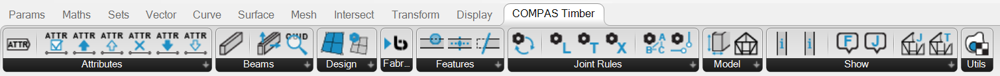

Tutorial
********

.. rst-class:: lead

Grasshopper plugin
==================

This Grasshopper plugin is a tool for designing timber frame structures from simple line input. 

|
|

Contents
========

.. toctree::
    :maxdepth: 1
    :titlesonly:

    tutorials/grasshopper/workflow
    tutorials/grasshopper/assembly
    tutorials/grasshopper/beam
    tutorials/grasshopper/joints
    tutorials/grasshopper/features
