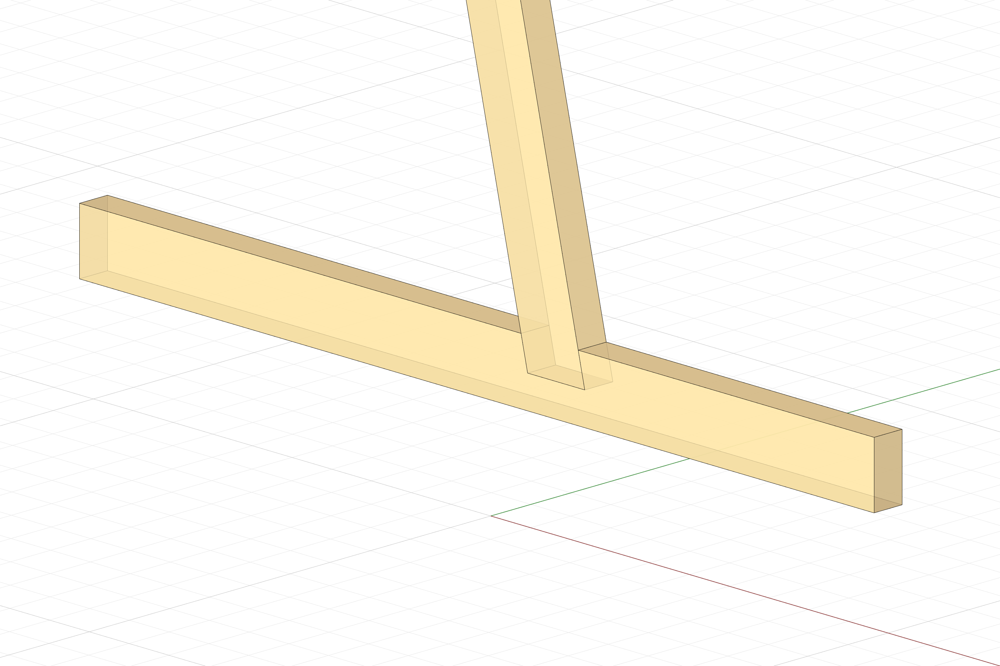
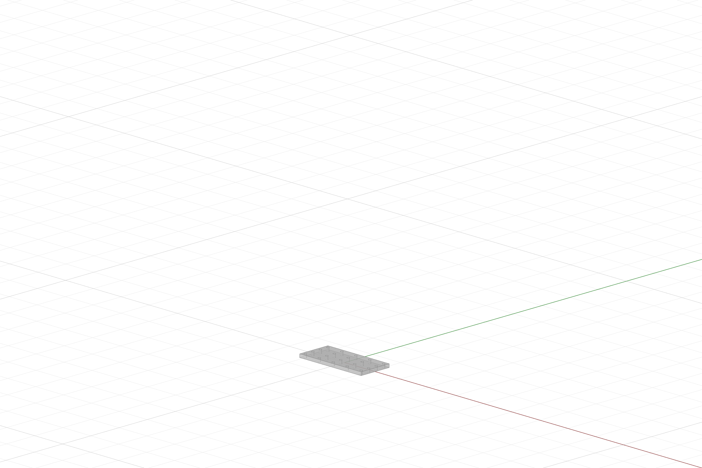
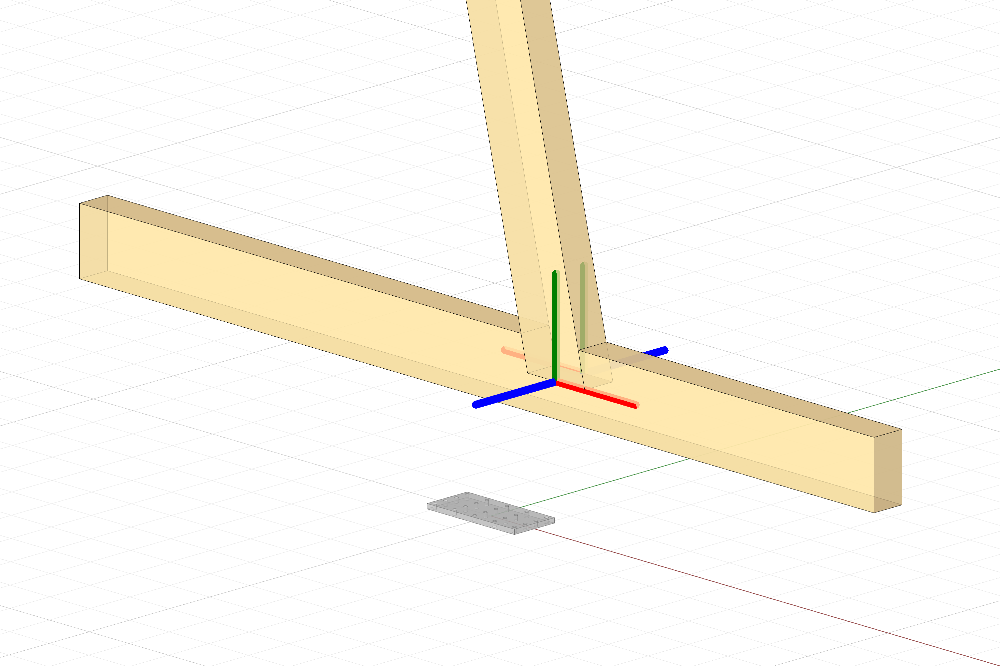
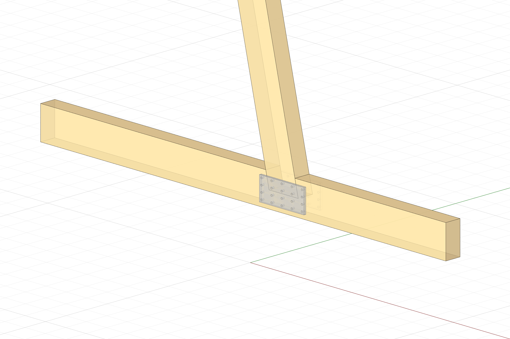
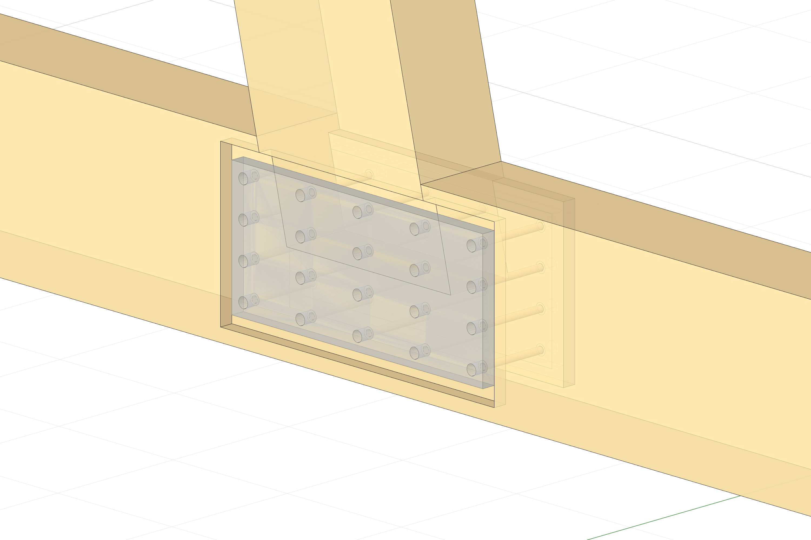

# A Plate Fastener on a TButt Joint

## Setup

We define our timber model with two separate beam elements: a main beam and a cross beam, and apply a T-Butt joint connection between them.

```python
from compas.geometry import Line

from compas_timber.elements import Beam
from compas_timber.model import TimberModel
from compas_timber.connections import TButtJoint

# Define the beams
cross_beam = Beam.from_centerline(Line([-100, 0, 30], [100, 0, 30]), width=7, height=14)
main_beam = Beam.from_centerline(Line([20, 0, 30], [-20, 0, 200]), width=7, height=14)

# Create the model and add the elements
model = TimberModel()
model.add_elements([cross_beam, main_beam])

# Create the TButtJoint
joint = TButtJoint.create(model, main_beam, cross_beam, mill_depth=7, force_pocket=True, conical_tool=True)

# Process the model joinery
model.process_joinery()

# Extract the geometry
beams = [beam.geometry for beam in model.beams]
```




## Setup the fastener

Before adding our fastener to the model and the two beams, we first need to model it.
We are creating a reference fastener; copies of this fastener will be automatically instantiated at specified locations and added to the model. This serves as the "generic" fastener and is, by default, modeled at the world origin.

First of all we define a `Fastener()` object to which we can add _parts_. Parts are the individual components of the fastener, such as plates, bolts, screws, etc. In this example we will only be adding a single part, a rectangular plate with a grid of holes. The holes represent the locations where bolts or screws would be placed to secure the joint.

```python
from compas_timber.fasteners import Fastener
from compas_timber.fasteners import RectangularPlate

# Initialize the fastener
fastener = Fastener()

# Create the Rectangular plate and add a grid of holes
plate = RectangularPlate(width=22, height=10, thickness=1)
plate.add_holes_grid(nx=5, ny=4, border_padding=1, diameter=0.8)
fastener.add_part(plate)

geo = fastener.geometry
```
As we can see the reference fastener is created at the world origin.



## Add the fastener to the model

To add the fastener to the model, we need to specify the location and orientation of the fastener in relation to the beams. We can do that by setting the `Fastener.target_frames` attribute to a list of frames that we are free to choose. In this case we want to place the fastener at the location of the joint, and orient it such that it is parallel to the cross beam and perpendicular to the main beam. We want to define the target frames as shown in the image.



```python
from compas_timber.fasteners import Fastener
from compas_timber.fasteners import RectangularPlate

# Initialize the fastener
fastener = Fastener()

# Create the Rectangular plate and add a grid of holes
plate = RectangularPlate(width=22, height=10, thickness=1)
plate.add_holes_grid(nx=5, ny=4, border_padding=1, diameter=0.8)
fastener.add_part(plate)

# Define and set the target frames
front_t_frame = Frame([20, -3.5, 30], [1, 0, 0], [0, 0, 1])
back_t_frame = Frame([20, 3.5, 30], [-1, 0, 0], [0, 0, 1])
fastener.target_frames = [front_t_frame, back_t_frame]

geo = fastener.geometry
```


We can now add the fastener to the model by specifing wich elements is connecting.

```python
from compas.geometry import Line
from compas.geometry import Frame

from compas_timber.elements import Beam
from compas_timber.model import TimberModel
from compas_timber.connections import TButtJoint


from compas_timber.fasteners import Fastener
from compas_timber.fasteners import RectangularPlate

# Define the beams

cross_beam = Beam.from_centerline(Line([-100, 0, 30], [100, 0, 30]), width=7, height=14)
main_beam = Beam.from_centerline(Line([20, 0, 30], [-20, 0, 200]), width=7, height=14)

# Create the model and add the elements
model = TimberModel()
model.add_elements([cross_beam, main_beam])

# Create the TButtJoint
joint = TButtJoint.create(model, main_beam, cross_beam, mill_depth=7, force_pocket=True, conical_tool=True)

# Initialize the fastener
fastener = Fastener()

# Create the Rectangular plate and add a grid of holes
plate = RectangularPlate(width=22, height=10, thickness=1)
plate.add_holes_grid(nx=5, ny=4, border_padding=1, diameter=0.8)
fastener.add_part(plate)

# Define and set the target frames
front_t_frame = Frame([20, -3.5, 30], [1, 0, 0], [0, 0, 1])
back_t_frame = Frame([20, 3.5, 30], [-1, 0, 0], [0, 0, 1])
fastener.target_frames = [front_t_frame, back_t_frame]


# Add the fastener to the model
model.add_fastener(fastener, [cross_beam, main_beam])

# Process the model joinery
model.process_joinery()


# Extract the geometries
beams = [beam.geometry for beam in model.beams]

fasteners = []
for fstn in model.fasteners:
    fasteners.extend(fstn.geometry)
```



## Process fasteners

Fasteners can also add features and fabrications processings to the elements they connect. In this case we cand add a recess pocket for the plate and drillings for each screw.

```python
# Initialize the fastener
fastener = Fastener()

# Create the Rectangular plate and add a grid of holes
plate = RectangularPlate(width=22, height=10, thickness=1, recess=1, recess_offset=1)
plate.add_holes_grid(nx=5, ny=4, border_padding=1, diameter=0.8, drilling_depth=10, drilling_diameter=0.5)
fastener.add_part(plate)

# Define and set the target frames
front_t_frame = Frame([20, -3.5, 30], [1, 0, 0], [0, 0, 1])
back_t_frame = Frame([20, 3.5, 30], [-1, 0, 0], [0, 0, 1])
fastener.target_frames = [front_t_frame, back_t_frame]
```

And do not forget to call: 
```python
model.process_fasteners()
```




## Complete Code
```python

from compas.geometry import Line
from compas.geometry import Frame

from compas_timber.elements import Beam
from compas_timber.model import TimberModel
from compas_timber.connections import TButtJoint


from compas_timber.fasteners import Fastener
from compas_timber.fasteners import RectangularPlate

# Define the beams
cross_beam = Beam.from_centerline(Line([-100, 0, 30], [100, 0, 30]), width=7, height=14)
main_beam = Beam.from_centerline(Line([20, 0, 30], [-20, 0, 200]), width=7, height=14)

# Create the model and add the elements
model = TimberModel()
model.add_elements([cross_beam, main_beam])

# Create the TButtJoint
joint = TButtJoint.create(model, main_beam, cross_beam, mill_depth=7, force_pocket=True, conical_tool=True)

# Initialize the fastener
fastener = Fastener()

# Create the Rectangular plate and add a grid of holes
plate = RectangularPlate(width=22, height=10, thickness=1, recess=1, recess_offset=1)
plate.add_holes_grid(nx=5, ny=4, border_padding=1, diameter=0.8, drilling_depth=10, drilling_diameter=0.5)
fastener.add_part(plate)

# Define and set the target frames
front_t_frame = Frame([20, -3.5, 30], [1, 0, 0], [0, 0, 1])
back_t_frame = Frame([20, 3.5, 30], [-1, 0, 0], [0, 0, 1])
fastener.target_frames = [front_t_frame, back_t_frame]

# Add the fastener to the model
model.add_fastener(fastener, [cross_beam, main_beam])

# Process the model joinery
model.process_joinery()

# Process the model fasteners
model.process_fasteners()


# Extract the geometries
beams = [beam.geometry for beam in model.beams]
fasteners = []

for fstn in model.fasteners:
    fasteners.extend(fstn.geometry)
    
```
