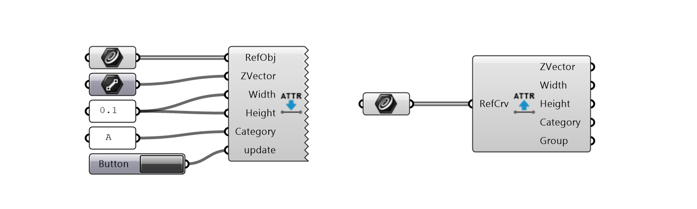
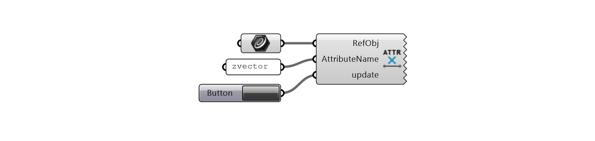

# Attributes

This group of components is intended for a hybrid design workflow when the input `Centerlines` and parameters of the beams are stored in a Rhino document. The attributes are encoded as a string and stored in the source object's (e.g. in a *Line* object in the Rhino document) *name* attribute.
This string entails concatenated key-value pairs, using a colon (`:`) as a separator between a key and a value of each entry, and an underscore (`_`) to separate entries (for example: *attr1name:attr1value_attr2name:attr2value*)

There are four *standard* attributes, corresponding to the inputs in the [beams](beams.md) components: `Width`, `Height`, `Category` or `ZVector`.

## Standard Attributes

**SetStandardAttributes** - sets the standard attributes' values, e.g. writes them to the source object.
**GetStandardAttributes** - gets the standard attributes from the source object. *Group* attribute refers to indices of groups if source objects were grouped.

{ width=100% }

## Custom Attributes

It is also possible to set and retrieve custom, user-defined attributes. This may be useful if later the source objects need to be filtered according to additional criteria.
These attributes are only set to source objects, not the beams created from them.

**SetCustomAttributes** - sets a custom attribute and its value to the source object.
**GetCustomAttributes** - gets all attributes from the source object.

{ width=100% }

## Check Attributes

**CheckStandardAttributes** - checks if the standard attributes are set and/or correctly formatted, and displays errors or missing values.

{ width=100% }

## Delete Attributes

**DeleteAttributes** - removes the given attribute and its value from the source object.

{ width=100% }
