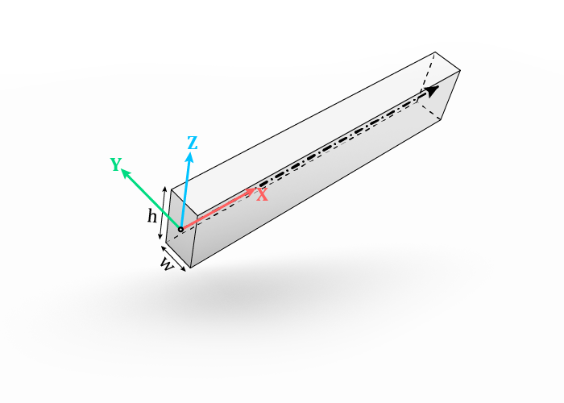

# Beams

A `compas_timber.parts.Beam` object represents a linear (straight) timber part with a rectangular cross-section - for example as a stud, rafter, beam, joist etc.
It has a local coordinate system, where the X-axis corresponds with the *centerline*, Y-axis with the *width* of the cross-section and Z-axis with the *height* of the cross-section.
The *origin* is located at the start of the centerline.

{ width=50% }

Beams are created with the component `Beam` - to create a beam from a Grasshopper `Line` or `LineCurve`, or from a `Guid` of a `Line` object referenced from an active Rhino document.
The latter is intended for a design workflow, where the input geometry (centerlines, etc.) is drawn or stored in a Rhino document instead of generated within the Grasshopper environment.

**Inputs:**

*   `Centerline` : one or more centerline of the beam(s), also called the major axis.
*   `ZVector`: (optional) a vector used to define the rotation of the cross-section around the centerline.
    Together with the centerline it indicates the plane in which the Z-axis of the beam lies,
    which is to say that `ZVector` does not have to be perpendicular, but cannot be parallel, to the centerline.
    If `None` is provided, a default direction will be used:
    *   vector [1,0,0] (X-direction in world coordinates) if centerline is vertical (parallel to Z-direction in world coordinates)
    *   otherwise vector [0,0,1] (Z-direction in world coordinates)
*   `Width`: the smaller dimension of the cross-section (by convention).
*   `Height`: the larger dimension of the cross-section (by convention).
*   `Category`: (optional) a string as an additional attribute, used later to define joint rules in **Direct Joint Rules** component. See also [workflow](workflow.md).
*   `updateRefObj`: (optional) set it to `True` to write the new attributes to the source Line objects. See also [attributes](attributes.md).

**Outputs:**

*   `Beam` : the resulting beam(s).
*   `Blank`: the corresponding blank beam. The blank represents the raw material from which the beam is cut and without [features](features.md). It is used to define the stock size for the beam.

{ width=40% }

Once a `Beam` is created, it can be used as an input for the [model](model.md) component or the following components:

## DecomposeBeam

Extracts the frame, centreline, box, width and height from a Beam.

{ width=40% }

## FindBeamByRhinoGuid

Finds a specific Beam corresponding to a referenced Rhino curve or line.

{ width=40% }
