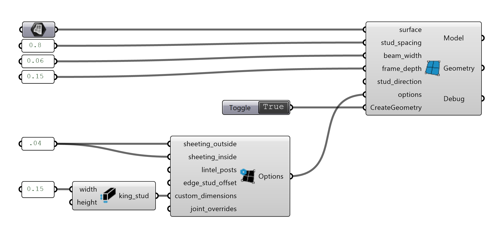

# Design

Design Components help to generate standard Slab structures from Surfaces, using different Options.

{ width=80% }

A bit of timber construction vocabulary will help you work with these components:

{ width=90% }

## Surface Model

Creates a Model from a Surface

**Inputs:**

*   `surface` - Referenced planar `Surface` from which to generate beams and joint rules.
*   `stud_spacing` - `Number`: Spacing between the Studs.
*   `beam_width` - `Number`: Width of the cross-section.
*   `frame_depth` - `Number`: Thickness of the frame section of the resulting model. Used to set Beam height.
*   `stud_direction` - `Vector` or `Line`: Optional, Vector defining the direction of stud in the model. Default is World-Z.
*   `options` - Optional, **Surface Model Options** Component
*   `CreateGeometry` - `Boolean`: Set to True to generate Joint and Feature geometry.

**Outputs:**

*   `Model` : the resulting COMPAS Timber Model.
*   `Geometry` : Model geometry.
*   `DebugInfo` : Debug information object in the case of feature or joining errors.

## Surface Model Options

Creates the Options for the Surface Model

**Inputs:**

*   `sheeting_outside` - `Number`: Optional, thickness of sheeting on the side of assembly closest to input surface. If zero, no sheeting will be added.
*   `sheeting_inside` - `Number`: Optional, thickness of sheeting on the side of assembly furthest from input surface. If zero, no sheeting will be added.
*   `lintel_posts` - `Boolean`: Optional, if False, jack studs will not be generated and headers will butt directly onto king studs.
*   `edge_stud_offset` - `Number`: Optional, distance to offset the studs at the edge of the assembly. If zero, the studs will be flush with the edge of the assembly.
*   `custom_dimensions` - Optional, from **Custom Dimensions** Component. Beam dimensions must either be defined here or in with beam_width and frame_depth inputs.
*   `joint_overrides` - Optional, from **Joint Overrides** Component. Allows user to specify joints between specific beam types in surface model.

**Outputs:**

*   `Options` : the resulting Beam Model Options.

## Custom Beam Dimensions

This is a dynamic component. Sets Beam Dimensions for a selected Beam Type in the Surface Model.

**Inputs:**

*   `width` - `Number`: Width of all studs, king_studs, jack_studs, edge_studs, plates, headers or sills.
*   `height` - `Number`: Height of all studs, king_studs, jack_studs, edge_studs, plates, headers or sills.

**Outputs:**

*   `Beam Type` : stud, king_stud, jack_stud, edge_stud, plate, header or sill.
