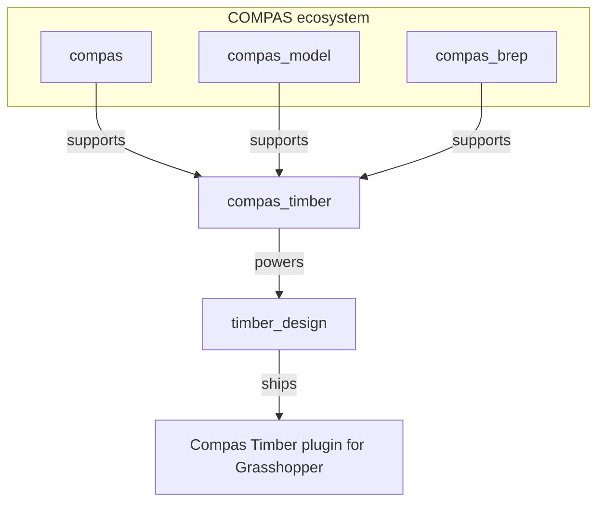

# Development

The Grasshopper components are not developed in the `compas_timber` repository.
They live in the separate [timber_design](https://github.com/gramaziokohler/timber_design) repository,
which builds on `compas_timber` as its Python backend:

- **[timber_design](https://github.com/gramaziokohler/timber_design)** — the Grasshopper components and the Yak package. The components themselves live in [`src/timber_design/ghpython/components`](https://github.com/gramaziokohler/timber_design/tree/main/src/timber_design/ghpython/components). Report plugin issues (components, toolbar, Grasshopper behavior) in the [timber_design issue tracker](https://github.com/gramaziokohler/timber_design/issues).
- **[compas_timber](https://github.com/gramaziokohler/compas_timber)** — the modeling, joinery and fabrication engine the components call into. Report core issues in the [compas_timber issue tracker](https://github.com/gramaziokohler/compas_timber/issues).

!!! note
    Although it is built from the `timber_design` repository, the package you install through Rhino's
    Package Manager is still published under the name `compas_timber`.

## Where timber_design fits in the ecosystem

The components themselves are thin: they collect inputs in Grasshopper and call `timber_design` / `compas_timber`
Python code running in Rhino's CPython environment. This is why changes to the plugin land in the
`timber_design` repository, while changes to how beams, joints or BTLx processings behave land in
the `compas_timber` repository.
