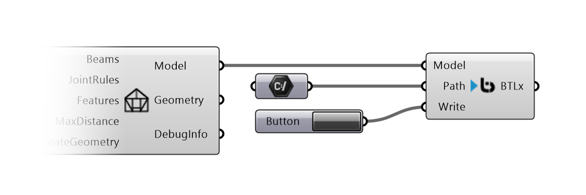

# Fabrication

Fabrication components are used to create Data for machining Compas Timber Models.

## Write BTLx

Writes a BTLx File from a Compas Timber Model.

{ width=60% }

**Inputs:**

*   `Model` : the Compas Timber Model.
*   `Path` : a `File Path` where to save the BTLx File.
*   `Write` : Writes the File if the Input is `True`.

**Outputs:**

*   `BTLx` : the BTLx Content as xml text.
