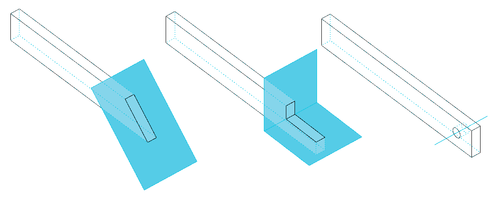
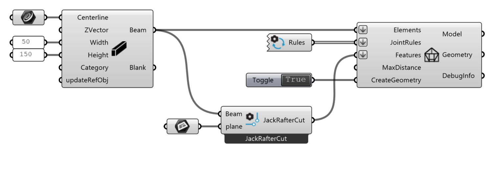
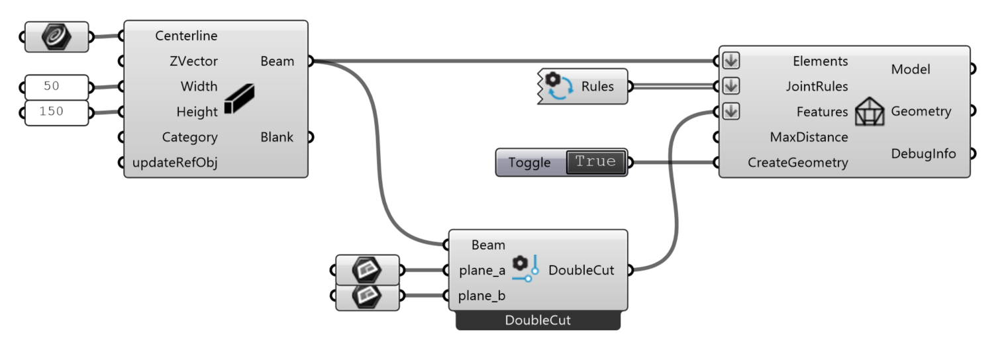
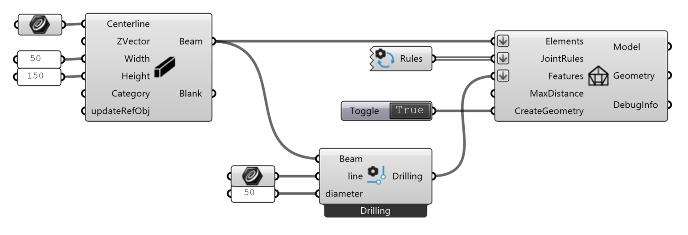

# Features

Features are additional geometric operations on Beams:

{ width=75% }

## Jack Rafter Cut Feature

{ width=100% }

**JackRafterCut** feature cuts beam with a plane. The part of the beam lying on the *z-positive* side of the plane will be removed.

*   `Beam` : the beam to be trimmed.
*   `Plane` : the plane to trim the beam as a surface.

!!! note "Plane angle"

    Angle between the cutting plane and the beam axis must be > 0.01 and < 179.9.

## Double Cut Feature

{ width=100% }

**DoubleCut** feature cuts beam with two planes. The part of the beam lying on the *z-positive* sides of both planes will be removed.

*   `Beam` : the beam to be trimmed.
*   `Plane_a` : the first plane to trim the beam as a surface.
*   `Plane_b` : the second plane to trim the beam as a surface.

## Drilling Feature

{ width=100% }

**Drilling** feature is a boolean operation to subtract a cylindrical hole from a beam.

*   `Beam` : the beam to be drilled.
*   `Line` : the axis of the hole as a line
*   `Diameter` : the diameter of the hole

The output `Feature` is to be used as input for the **Model** component. See [model](model.md).
