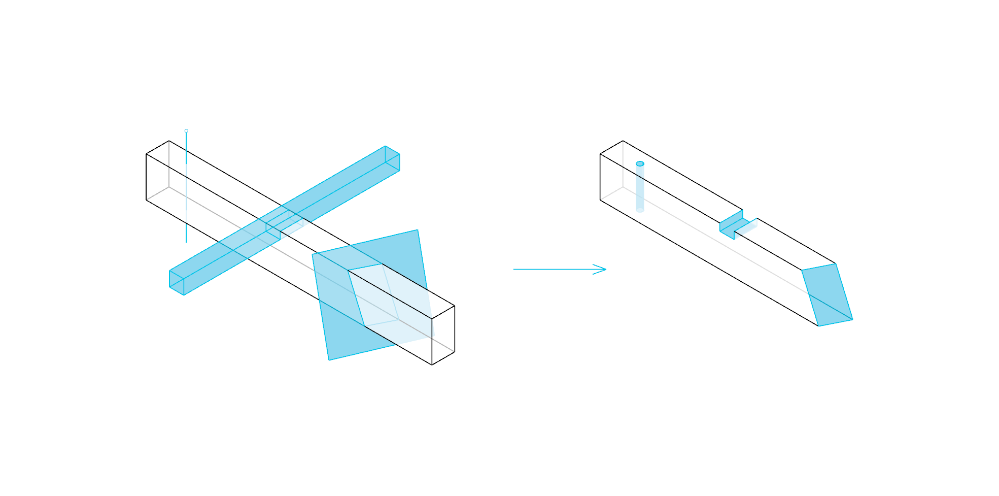
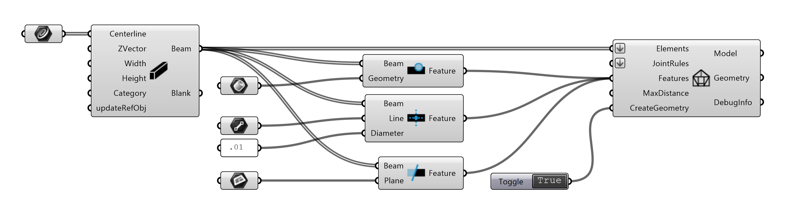

********
Features
********

Features are additional geometric operations on beams:

|

|

Brep Subtraction Feature
^^^^^^^^^^^^^^^^^^^^^^^^
**BrepSubtractionFeature** is a boolean operation to subtract any *Brep* geometry from a beam.

* `Beam` : the beam to be subtracted from
* `Brep` : the Brep geometry to subtract as a Brep

Brep Drill Hole Feature
^^^^^^^^^^^^^^^^^^^^^^^
**BrepDrillHoleFeature** is a boolean operation to subtract a hole from a beam.

* `Beam` : the beam to be drilled
* `Line` : the axis of the hole as a Line
* `Diameter` : the diameter of the hole

Trim Feature
^^^^^^^^^^^^
**TrimFeature** cuts a beam with a *Plane*. The part of the beam lying on the *z-positive* side of the plane will be removed.

* `Beam` : the beam to be trimmed
* `Plane` : the plane to trim the beam as a surface

The output `Feature` is to be used as input for the **Model** component. See :doc:`model`.

