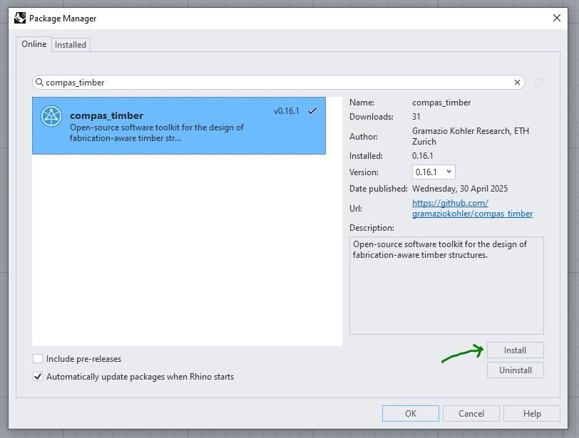
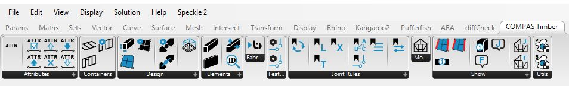

# Installation Guide

This guide explains how to install the `compas_timber` package for use in Grasshopper with Rhino 8 and Rhino 7.

## Rhino 8 Installation

1. **Open Rhino 8.**
2. In Rhino's command line, type `PackageManager` and press Enter. This opens the Package Manager window.:
3. In the Package Manager window, search for `compas_timber`.
4. Click **Install** to install the package.

    { width=100% }

5. Restart Rhino 8 to complete the installation.

After a successful installation, you should see the COMPAS Timber section in the Grasshopper toolbar.

6. To use the COMPAS Timber components, open Grasshopper and look for the COMPAS Timber tab in the toolbar.

    { width=100% }

## Troubleshooting

If you encounter issues, please consult the official documentation or seek help on the [COMPAS Forum](https://forum.compas-framework.org/).
