# Joint Rules

The Joints between [beams](beams.md) are defined by Joint Rules. There are four kinds of rules, where each of them overrides any lower-priority rule. The rules are listed hereafter from lowest to highest level of priority:

!!! note "Joint Topologies"

    There are three main topologies of how beams can connect to each other: **L**, **T** and **X**.

    { width=20% }

## Joint Rules Components

!!! note "Important: Dynamic Components"

    Joint Rules Components are dynamic: First place them on the Grasshopper Canvas. Now you can define the Joint they should apply by Right-Click & Selection from the Drop-Down List. The Inputs might change because every Joint has its own specific settings.

    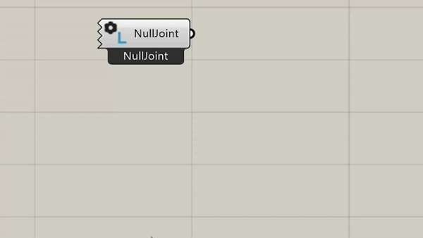{ width=55% }

### Default Joint Rules

This Component applies a L-Miter to all L-Topologies, a T-Butt to all T-Topologies and a X-HalfLap to all X-Topologies.

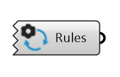{ width=20% }

### Topological Joint Rules

These Joint Rules are more specific and will overwrite the Default Joint Rules. The inputs are variable and depend on the joint type.

*   **L Topological Joint Rules:** This Component applies the L-Joint you select to all L-Topologies.
*   **T Topological Joint Rules:** This Component applies the T-Joint you select to all T-Topologies.
*   **X Topological Joint Rules:** This Component applies the X-Joint you select to all X-Topologies.

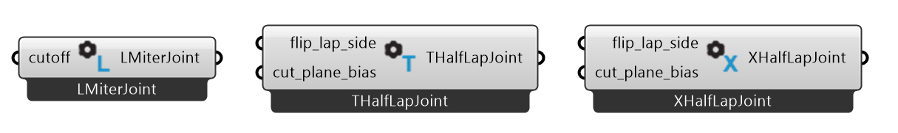{ width=100% }

### Category Joint Rules

This Joint Rule will overwrite all Topological Joint Rules. The Component defines a Joint type for all Joints between two beam Categories. The Categories are assigned through the string-input `Category` in the component `Beam`. The inputs are variable and depend on the joint type.

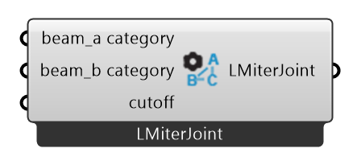{ width=40% }

### Direct Joint Rules

This Joint Rule is highly specific and will overwrite every other Joint Rule. The Component assigns a Joint type directly to specific beams. The Beams can be selected using the component `Find Beam By Rhino GUID` See also [beams](beams.md). The inputs are variable and depend on the joint type.

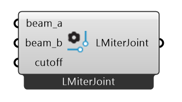{ width=35% }

### Surface Model Joint Override

This Joint Rule is used for the Surface Model to overwrite Joints between studs, king_studs, jack_studs, edge_studs, headers or sills.

{ width=35% }

## Joint Types

### L-Butt

The L-Butt extends one beam and shortens the other beam with a planar cut, to create a clean corner joint.

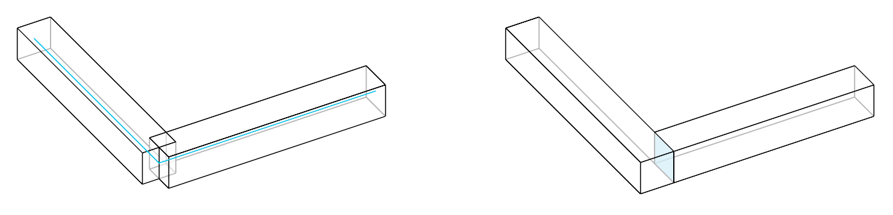{ width=50% }

**Inputs:**

*   `mill_depth` : Determins the depth of the pocket to be milled in the cross beam.
*   `small_beam_butts` : If true, the beam with a larger cross-section is considered as the cross beam.
*   `modify_cross` : If true, the cross beam is extended to the opposite face of the main beam and cut flush with it.
*   `reject_i` : If true, joint will not apply when the cross beam meets the main beam in an I topology.

### L-Lap

The *L-Half Lap* topology is when two beams meet at their ends at an angle. An L-Half Lap joint extends the two beams while removing the upper half of the overlap of one beam and the lower half of the overlaps the other to create a clean corner joint.

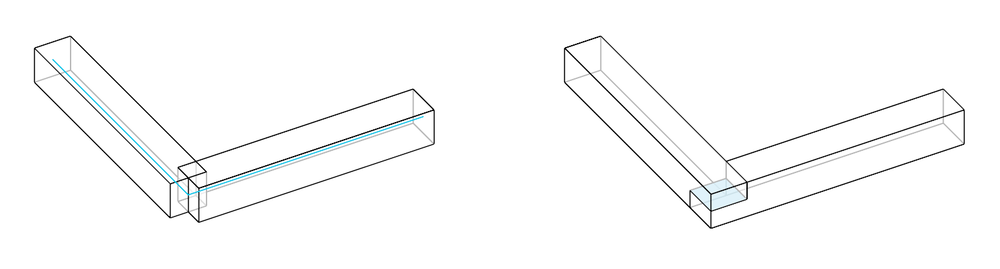{ width=50% }

**Inputs:**

*   `flip_lap_side` : Flips the lap side.
*   `cut_plane_bias` : Determines the depth of lap cuts on the beams. Input is a float in range from 0.01 to 0.99.

### L-Miter

The L-Miter joint extends and connects the two beams with a planar cut at a bisector of the angle between them.

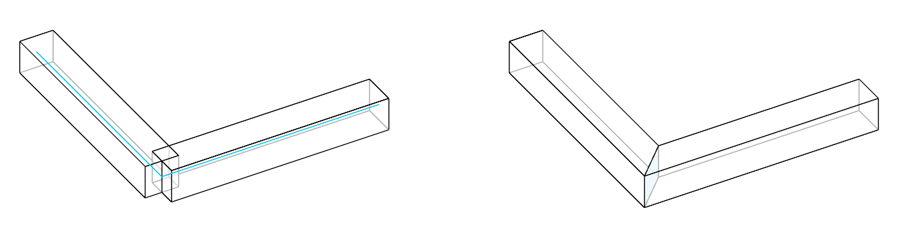{ width=50% }

**Inputs:**

*   `cutoff` : #TODO

### French Ridge Lap

The French ridge lap joint extends two beams and removes the upper half of the overlap on one beam and the lower half on the other. Unlike the L-Half Lap (presented above) joint, where the cut is made parallel in the centre of the beams, the cut of the French ridge lap joint is angled to keep the beams securely in place, preventing them from shifting.

The tilted cut plane is generated by sequentially connecting the following points:

*   a point at the middle of the inner vertical edges of the overlap;
*   a point at the bottom third of the outer vertical edge of the overlap along the lower beam;
*   a point at the middle of the outer vertical edge of the overlap;
*   a point at the top third of the outer vertical edge of the overlap along the upper beam.

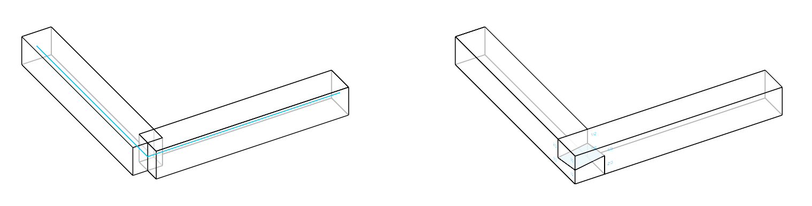{ width=50% }

**Inputs:**

*   `flip_lap_side` : Flips the lap side.
*   `drillhole_diam` : Determines the diameter of the hole for a dowel in the center of both laps.

### Tenon and Mortise

A tenon is added on the main beam, and a corresponding mortise is made on the cross beam to fit the main beam’s tenon.

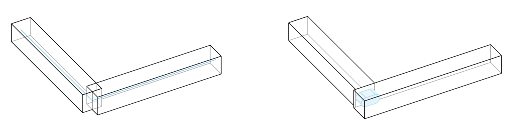{ width=50% }

**Inputs:**

*   `start_y` : Start position of the tenon along the y-axis of the main beam.
*   `start_depth` : Depth of the tenon from the surface of the main beam.
*   `rotation` : Rotation of the tenon around the main beam’s axis.
*   `length` : Length of the tenon along the main beam.
*   `width` : Width of the tenon.
*   `height` : Height of the tenon.
*   `shape` : The shape of the tenon, represented by an integer index: 0: AUTOMATIC, 1: SQUARE, 2: ROUND, 3: ROUNDED, 4: RADIUS.
*   `shape_radius` : The radius used to define the shape of the tenon, if applicable.

### T-Butt

The T-Butt joint shortens the *cross beam* with a planar cut, to match the side of the *main beam*. The *main beam* remains unchanged.

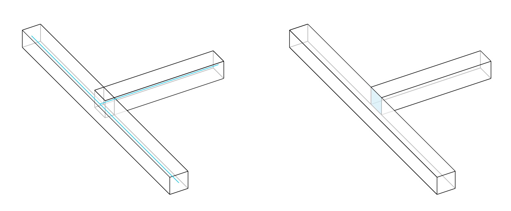{ width=50% }

**Inputs:**

*   `mill_depth` : Determins the depth of the pocket to be milled in the cross beam.

### T-Lap

A T-Half Lap joint crates an overlap between the *main beam* and the *cross beam*. The *cross beam* is extended to the opposite face of the *main beam* and cut flush with it to create a planar surface.
It is similar to a L-Half Lap joint: the upper half of the overlap of the cross beam is removed from the main beam and the lower half of the overlap of the main beam is removed from the cross beam.

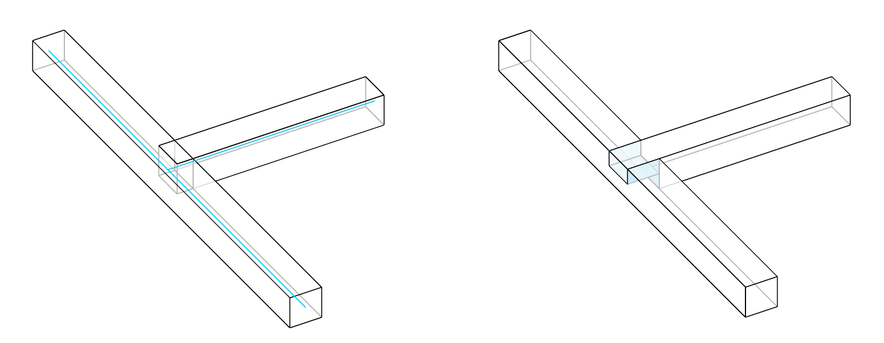{ width=50% }

**Inputs:**

*   `flip_lap_side` : Flips the lap side.
*   `cut_plane_bias` : Determines the depth of lap cuts on the beams. Input is a float in range from 0.01 to 0.99.

### Tenon and Mortise

A tenon is added on the main beam, and a corresponding mortise is made on the cross beam to fit the main beam’s tenon.

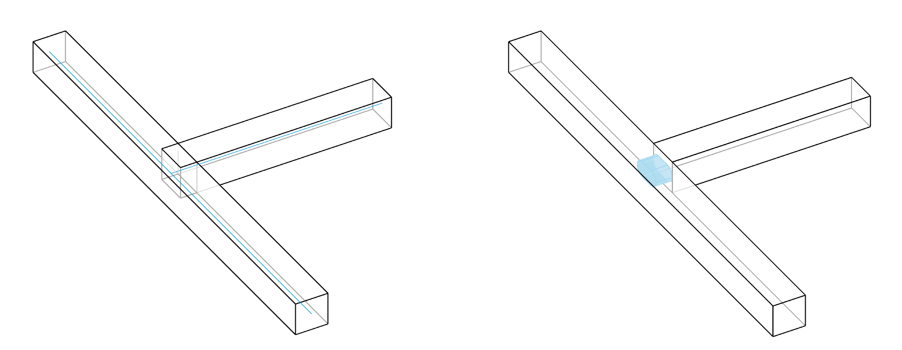{ width=50% }

**Inputs:**

*   `start_y` : Start position of the tenon along the y-axis of the main beam.
*   `start_depth` : Depth of the tenon from the surface of the main beam.
*   `rotation` : Rotation of the tenon around the main beam’s axis.
*   `length` : Length of the tenon along the main beam.
*   `width` : Width of the tenon.
*   `height` : Height of the tenon.
*   `shape` : The shape of the tenon, represented by an integer index: 0: AUTOMATIC, 1: SQUARE, 2: ROUND, 3: ROUNDED, 4: RADIUS.
*   `shape_radius` : The radius used to define the shape of the tenon, if applicable.

### T-Step

Two or more cuts are is made on the main beam and a notch is made on the cross beam to fit the main beam.

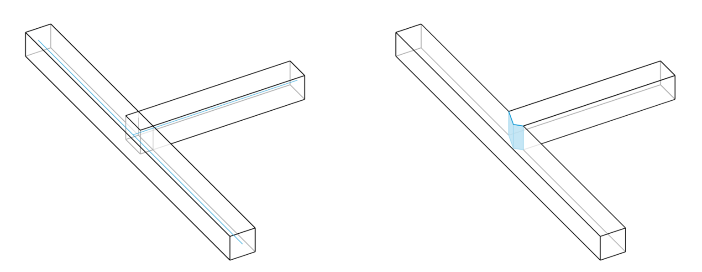{ width=50% }

**Inputs:**

*   `step_shape` : Shape of the step feature. 0: step, 1: heel, 2: double.
*   `step_depth` : Depth of the step cut. Combined with a heel cut it generates a double step cut.
*   `heel_depth` : Depth of the heel cut. Combined with a step cut it generates a double step cut.
*   `tapered_heel` : If True, the heel cut is tapered.
*   `tenon_mortise_height` : Height of the tenon (main beam) mortise (cross beam) of the Step Joint. If None, the tenon and mortise featrue is not created.

### T-Birdsmouth

A DoubleCut is created on the main beam to fit the cross beam. The position of the cross beam should allow the creation of the doblecut. If one of the sides of the cross beam is parallel to the axis of the main beam a doublecut cannot be created.

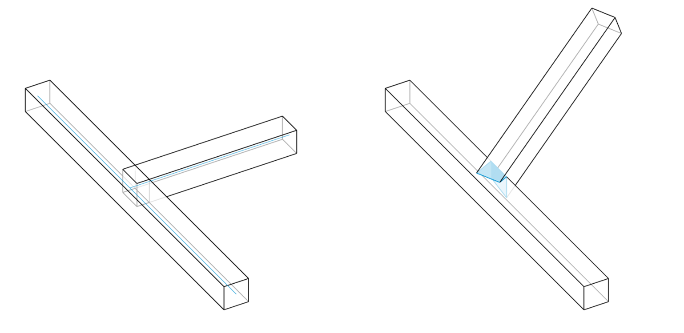{ width=50% }

### T-Dovetail

A dovetail cut is made on the main beam, and a corresponding notch is made on the cross beam to fit the main beam.

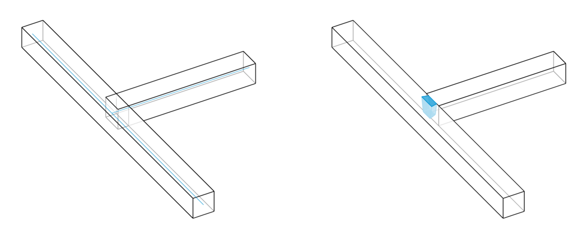{ width=50% }

**Inputs:**

*   `start_y` : Start position of the dovetail cut along the y-axis of the main beam.
*   `start_depth` : Depth of the dovetail cut from the surface of the main beam.
*   `rotation` : Rotation of the dovetail cut around the main beam’s axis.
*   `length` : Length of the dovetail cut along the main beam.
*   `width` : Width of the dovetail cut.
*   `cone_angle` : The angle of the dovetail cut, determining the taper of the joint.
*   `dovetail_shape` : The shape of the dovetail cut, represented by an integer index: 0: AUTOMATIC, 1: SQUARE, 2: ROUND, 3: ROUNDED, 4: RADIUS.
*   `tool_angle` :  The angle of the tool used to create the dovetail cut.
*   `tool_diameter` : The diameter of the tool used to create the dovetail cut.
*   `tool_height` : The height of the tool used to create the dovetail cut.

### X-Lap

The X-Half Lap joint removes the upper half of the overlap from one beam and the lower half from the other.

{ width=50% }

**Inputs:**

*   `flip_lap_side` : Flips the lap side.
*   `cut_plane_bias` : Determines the depth of lap cuts on the beams.

## Summary Table

The following table summarises the joint types that can be applied to the different joint topologies.

| Joint | L Topology | T Topology | X Topology |
| :--- | :--- | :--- | :--- |
| Butt | X | X | |
| Miter | x | | |
| Lap | X | X | X |
| French Ridge | X | | |
| Tenon and Mortise | X | X | |
| Step | | X | |
| Birdsmouth | | X | |
| Dovetail | | X | |
