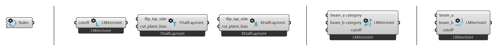

***********
Joint Rules
***********

The Joints between :doc:`beams` are defined by Joint Rules. There are four kinds of rules, where each of them overrides any lower-priority rule. The rules are listed hereafter from lowest to highest level of priority:

.. note::

    **Joint Topologies**
    
    There are three main topologies of how beams can connect to each other: **L**, **T** and **X**.

    .. image:: ../images/joint_topologies_diagramm.png
      :width: 20%

|
Joint Rules Components
----------------------
.. important::

    **Dynamic Components**

    The Joint Rules Components are dynamic: 
    First place them on the Grasshopper Canvas. 
    Now you can define the Joint they should apply by Right-Click & Selection from the Drop-Down List.
|

1. **Default Joint Rules** - This Component applies a L-Miter to all L-Topologies, a T-Butt to all T-Topologies 
   and a X-HalfLap to all X-Topologies. 
|
2. **Topological Joint Rules** - These Joint Rules are more specific and will overwrite the Default Joint Rules.
   The inputs are variable and depend on the joint type.

   *   **L Topological Joint Rules:** This Component applies the L-Joint you select to all L-Topologies.
   *   **T Topological Joint Rules:** This Component applies the T-Joint you select to all T-Topologies.
   *   **X Topological Joint Rules:** This Component applies the X-Joint you select to all X-Topologies.
|
3. **Category Joint Rules** - This Joint Rule will overwrite all Topological Joint Rules. 
   The Component defines a Joint type for all Joints between two beam Categories. 
   The Categories are assigned through the string-input `Category` in the component :code:`Beam`. 
   The inputs are variable and depend on the joint type. 
|
4. **Direct Joint Rules** - This Joint Rule is highly specific and will overwrite every other Joint Rule.
   The Component assigns a Joint type directly to specific beams. 
   The Beams can be selected using the component :code:`Find Beam By Rhino GUID` See also :doc:`beam`.
   The inputs are variable and depend on the joint type. 
|

Joint Types
----------------

L-Butt
^^^^^^
The L-Butt extends one beam and shortens the other beam with a planar cut, to create a clean corner joint.

.. image:: ../images/gh_joint_L-Butt.png
    :width: 40%

Inputs:

* `mill_depth` : #TODO
* `small_beam_butts` : If true, the beam with a larger cross-section is considered as the cross beam.
* `modify_cross` : If true, the cross beam is extended to the opposite face of the main beam and cut flush with it.
* `reject_i` : If true, joint will not apply when the cross beam meets the main beam in an I topology.

|

L-HalfLap
^^^^^^^^^

The *L-Half Lap* topology is when two beams meet at their ends at an angle.
An L-Half Lap joint extends the two beams while removing the upper half of the overlap of one beam and the lower half of the overlaps the other to create a clean corner joint.

.. image:: ../images/gh_joint_L-HalfLap.png
    :width: 40%

Inputs:

* `flip_lap_side` : Flips the lap side.
* `cut_plane_bias` : Determines the depth of lap cuts on the beams.

|

L-Miter
^^^^^^^^^

The L-Miter joint extends and connects the two beams with a planar cut at a bisector of the angle between them.

.. image:: ../images/gh_joint_L-Miter.png
    :width: 40%

Inputs:

* `cutoff` : #TODO

French Ridge Lap (not fully implemented)
^^^^^^^^^^^^^^^^

The French ridge lap joint extends two beams and removes the upper half of the overlap on one beam and the lower half on the other.
Unlike the L-Half Lap (presented above) joint, where the cut is made parallel in the centre of the beams, the cut of the French ridge lap joint is angled to keep the beams securely in place, preventing them from shifting.

The tilted cut plane is generated by sequentially connecting the following points:

* a point at the middle of the inner vertical edges of the overlap;
* a point at the bottom third of the outer vertical edge of the overlap along the lower beam;
* a point at the middle of the outer vertical edge of the overlap;
* a point at the top third of the outer vertical edge of the overlap along the upper beam.

.. image:: ../images/gh_joint_L-FrenchRidge.png
    :width: 40%

|

T-Butt
^^^^^^

The T-Butt joint shortens the *cross beam* with a planar cut, to match the side of the *main beam*. The *main beam* remains unchanged.

.. image:: ../images/gh_joint_T-Butt.png
    :width: 40%

Inputs:

* `mill_depth` : #TODO
* `birdsmouth` : #TODO

|

T-HalfLap
^^^^^^^^^

A T-Half Lap joint crates an overlap between the *main beam* and the *cross beam*. The *cross beam* is extended to the opposite face of the *main beam* and cut flush with it to create a planar surface.
It is similar to a L-Half Lap joint: the upper half of the overlap of the cross beam is removed from the main beam and the lower half of the overlap of the main beam is removed from the cross beam.

.. image:: ../images/gh_joint_T-HalfLap.png
    :width: 40%

Inputs:

* `flip_lap_side` : Flips the lap side.
* `cut_plane_bias` : Determines the depth of lap cuts on the beams.

|

X-HalfLap
^^^^^^^^^

The X-Half Lap joint removes the upper half of the overlap from one beam and the lower half from the other.

.. image:: ../images/gh_joint_X-HalfLap.png
    :width: 40%

Inputs:

* `flip_lap_side` : Flips the lap side.
* `cut_plane_bias` : Determines the depth of lap cuts on the beams.

|

Summary Table
----------------

The following table summarises the joint types that can be applied to the different joint topologies.

============   =========== =========== ===========
Joint          L Topology  T Topology  X Topology
============   =========== =========== ===========
Butt           X           X
Miter          x
HalfLap        X           X           X
French Ridge   X
============   =========== =========== ===========

