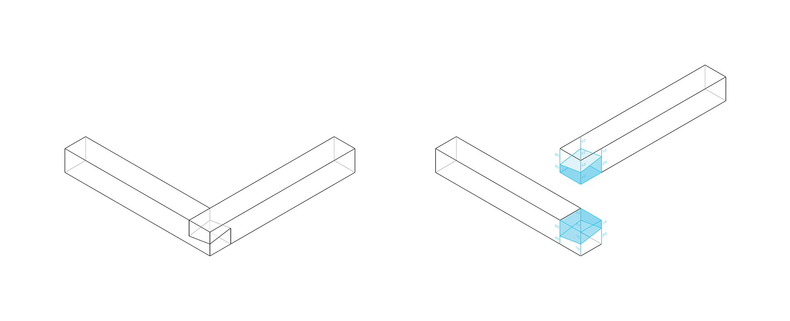
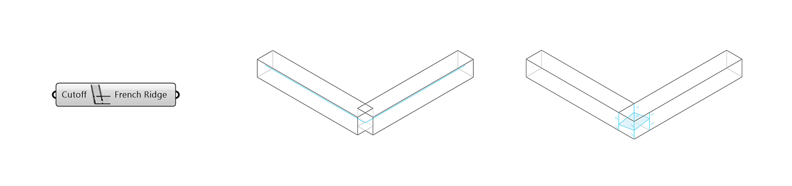

******
Joints
******

In COMPAS Timber The joints between the beams are defined according to their topology and a joint type is then applied.

Joint Topologies
----------------

There are three main topologies of how beams can connect to each other: **L**, **T** and **X**.

* **L** - a corner, i.e. two beams meet at their ends at an angle.
* **T** - one beam connects with one of its ends along the length of the other.
* **X** - the beams cross each other.

.. image:: ../images/joint_topologies_diagramm.png
    :width: 30%

Joint Types
----------------

Joints for *L* topologies
^^^^^^

For a *L* topology, several types of joint can be applied. Four of these are implemented in the current version of the COMPAS Timber: *French Ridge Lap*, *L-Butt*, *L-Half Lap* and *L-Miter*.

|

**French Ridge Lap** joint (*not fully implemented*)

A French ridge lap joint extends two beams and removes the upper half of the overlap on one beam and the lower half on the other.
Unlike the :doc:`L-Half Lap` joint, where the cut is made parallel in the centre of the beams, the cut of the French ridge lap joint is angled to keep the beams securely in place, preventing them from shifting.

The tilted cut plane is generated as follow:

* the inner vertical edges of the overlap is split in the middle, generating a point;
* the vertical edge of the overlap along the lower beam is split at the bottom third, generating a point;
* the outer vertical edges of the overlap is split in the middle, generating a point;
* the vertical edge of the overlap on the lower beam is split at the top third, generating a point.

By connecting sequentially these points, the tilted cut plane is generated.

:code:`French Ridge Lap Options` component

Inputs:

* `Cutoff` : For very acute angles, limit the extension of the tip/beak of the joint.

|

**L-Butt** joint

A L-Butt extends one beam and shortens the other beam with a planar cut, to create a clean corner joint.

.. image:: ../images/LButt_diagramm.png
    :width: 50%

:code:`L-Butt Options` component

Inputs:

* `SmallBeamButts` : If true, the beam with a larger cross-section is considered as the cross beam.
* `ModifyCross` : If true, the cross beam is extended to the opposite face of the main beam and cut flush with it.
* `RejectI` : If true, joint will not apply when the cross beam meets the main beam in an I topology.

|

**L-Half Lap** joint

A *L-Half Lap* topology is when two beams meet at their ends at an angle.
An L-Half Lap joint extends the two beams while removing the upper half of the overlap of one beam and the lower half of the overlaps the other to create a clean corner joint.

.. image:: ../images/LButt_diagramm.png
    :width: 50%

:code:`L-Half Lap Options` component

Inputs:

* `FlipLapSide` : flip the side of the lap joint
* `CutPlaneBias` : determines the depth of lap cuts on the beams

|

**L-Miter** joint

A L-Miter joint extends and connects the two beams with a planar cut at a bisector of the angle between them.

.. image:: ../images/LButt_diagramm.png
    :width: 50%

:code:`L-Miter joint Options` component

Inputs:

* `Cutoff` : For very acute angles, limit the extension of the tip/beak of the joint.

Joints for *T* topologies
^^^^^^

A *T* topology is when one beam connects with one of its ends along the length of the other beam.
For a *T* topology, several types of joint can be applied. Two of these are implemented in the current version of the COMPAS Timber: *T-Butt* and *T-Half Lap*.

|

**T-Butt** joint

A T-Butt joint shortens the *cross beam* with a planar cut, to match the side of the *main beam*. The *main beam* remains unchanged.

.. image:: ../images/TButt_diagramm.png
    :width: 50%

:code:`T-Butt Options` component

Inputs:

* `Gap` : Gap for tolerance between the beams, i.e., if the distance between the beams is less than the gap, the joint will be applied.

|

**T-Half Lap** joint

A T-Half Lap joint crates an overlap between the *main beam* and the *cross beam*. The *cross beam* is extended to the opposite face of the *main beam* and cut flush with it and similar to a :doc:``L-Half Lap`` joint, the upper half
of the overlap of the cross beam is removed from the main beam and the lower half of the overlap of the main beam is removed from the cross beam.

.. image:: ../images/TButt_diagramm.png
    :width: 50%

:code:`T-Half Lap` component

Inputs:

* `FlipLapSide` : flip the side of the lap joint.
* `CutPlaneBias` : determines the depth of lap cuts on the beams.

|

Joints for *X* topologies
^^^^^^^

A *X* topology is when two beams cross each other along their length.
For a *X* topology, several types of joint can be applied. One of these are implemented in the current version of the COMPAS Timber: *T-Butt* and *T-Half Lap*.

|

**X-Half Lap** joint

A X-Half Lap joint shortens the *cross beam* with a planar cut, to match the side of the *main beam*. The *main beam* remains unchanged.

.. image:: ../images/TButt_diagramm.png
    :width: 50%

:code:`T-Butt Options` component

Inputs:

* `Gap` : Gap for tolerance between the beams, i.e., if the distance between the beams is less than the gap, the joint will be applied.

|

.. image:: ../images/LMiter_diagramm.png
    :width: 50%

|

.. list-table:: matching joint topologies and joint types
   :widths: 5 10 10 10
   :header-rows: 1
   :stub-columns: 1

   * -
     - L Topology
     - T Topology
     - X Topology
   * - L Butt
     - x
     -
     -
   * - L-Miter
     - x
     -
     -
   * - L-HalfLap
     - x
     -
     -
   * - French Ridge Lap
     - x
     -
     -
   * - T-Butt
     -
     - x
     -
   * - T-Half Lap
     -
     - x
     -
   * - X-HalfLap
     -
     -
     - x

|

.. note::
    Output

    The joint output is to be connected to the :code:`Assembly` component to visualise and generate the geometry of the final assembly of the beams, with their joints.
