******
Joints
******

In COMPAS Timber the joints between the beams are defined according to their topology and a joint type is then applied.

Joint Topologies
----------------

There are three main topologies of how beams can connect to each other: **L**, **T** and **X**.

* **L** - a corner, i.e. two beams meet at their ends at an angle.
* **T** - one beam connects with one of its ends along the length of the other.
* **X** - the beams cross each other.

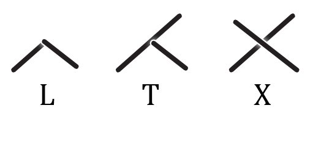

Joint Types
----------------

Joints for *L* Topologies
^^^^^^

For a *L* topology, several types of joint can be applied. Four of these are implemented in the current version of the COMPAS Timber: *French Ridge Lap*, *L-Butt*, *L-Half Lap* and *L-Miter*.

|

**L-Butt** joint

The L-Butt extends one beam and shortens the other beam with a planar cut, to create a clean corner joint.

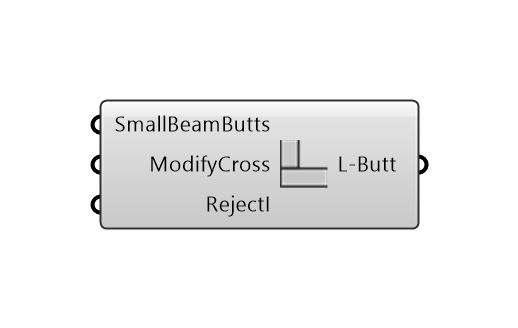

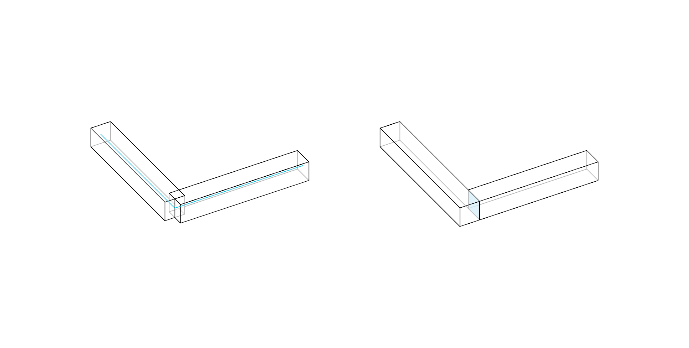

:code:`L-Butt Options` component

Inputs:

* `SmallBeamButts` : If true, the beam with a larger cross-section is considered as the cross beam.
* `ModifyCross` : If true, the cross beam is extended to the opposite face of the main beam and cut flush with it.
* `RejectI` : If true, joint will not apply when the cross beam meets the main beam in an I topology.

|

**L-Half Lap** joint

The *L-Half Lap* topology is when two beams meet at their ends at an angle.
An L-Half Lap joint extends the two beams while removing the upper half of the overlap of one beam and the lower half of the overlaps the other to create a clean corner joint.

.. image:: ../images/gh_Joint_L-HalfLap.png
    :width: 20%

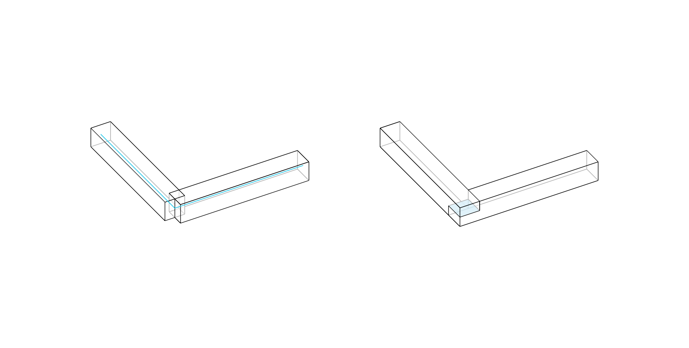

:code:`L-Half Lap Options` component

Inputs:

* `FlipLapSide` : Flips the lap side.
* `CutPlaneBias` : Determines the depth of lap cuts on the beams.

|

**L-Miter** joint

The L-Miter joint extends and connects the two beams with a planar cut at a bisector of the angle between them.

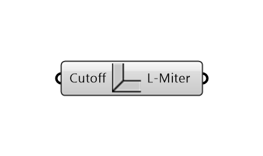

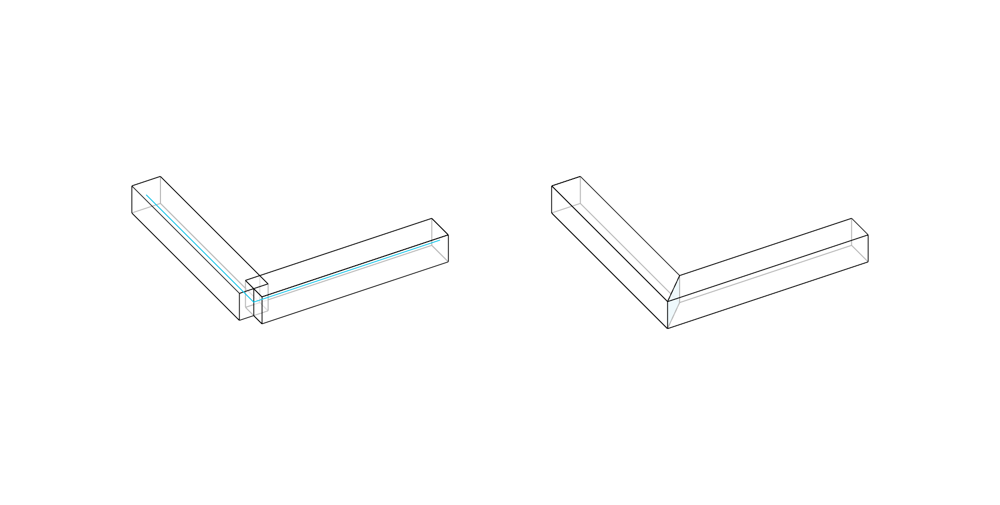

:code:`L-Miter joint Options` component

|

**French Ridge Lap** joint (*not fully implemented*)

The French ridge lap joint extends two beams and removes the upper half of the overlap on one beam and the lower half on the other.
Unlike the L-Half Lap (presented above) joint, where the cut is made parallel in the centre of the beams, the cut of the French ridge lap joint is angled to keep the beams securely in place, preventing them from shifting.

The tilted cut plane is generated by sequentially connecting the following points:

* a point at the middle of the inner vertical edges of the overlap;
* a point at the bottom third of the outer vertical edge of the overlap along the lower beam;
* a point at the middle of the outer vertical edge of the overlap;
* a point at the top third of the outer vertical edge of the overlap along the upper beam.

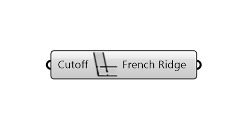

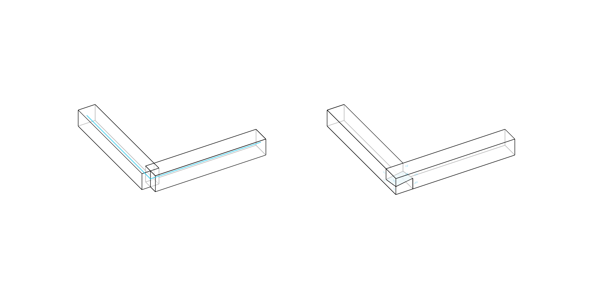

:code:`French Ridge Lap Options` component

|

Inputs:

* `Cutoff` : For very acute angles, limit the extension of the tip/beak of the joint.

Joints for *T* Topologies
^^^^^^

The *T* topology is when one beam connects with one of its ends along the length of the other beam.
For a *T* topology, several types of joint can be applied. Two of these are implemented in the current version of the COMPAS Timber: *T-Butt* and *T-Half Lap*.

|

**T-Butt** joint

The T-Butt joint shortens the *cross beam* with a planar cut, to match the side of the *main beam*. The *main beam* remains unchanged.

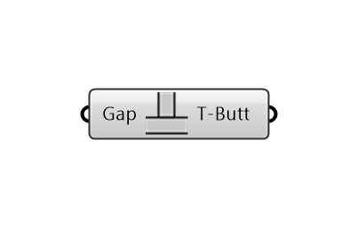

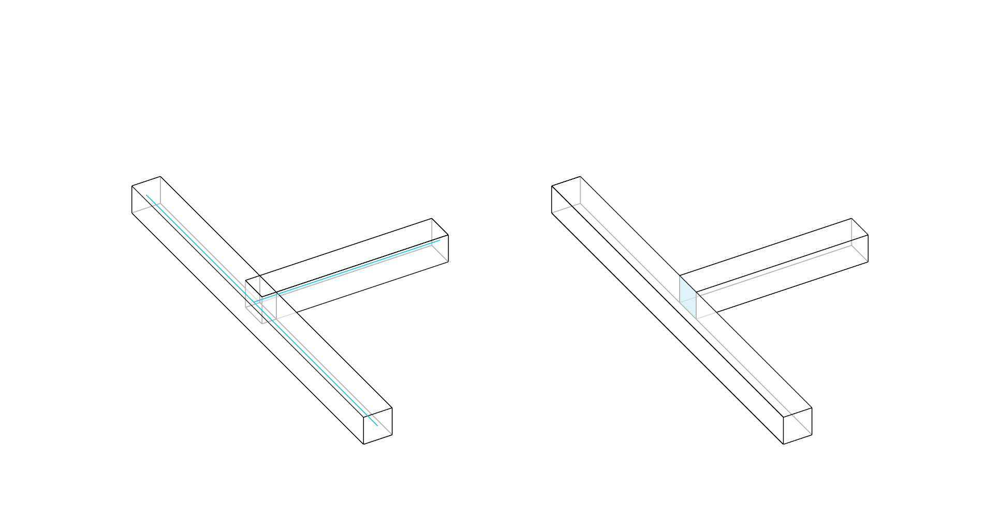

:code:`T-Butt Options` component

Inputs:

* `Gap` : Gap for tolerance between the beams, i.e., if the distance between the beams is less than the gap, the joint will be applied.

|

**T-Half Lap** joint

A T-Half Lap joint crates an overlap between the *main beam* and the *cross beam*. The *cross beam* is extended to the opposite face of the *main beam* and cut flush with it to create a planar surface.
It is similar to a L-Half Lap joint: the upper half of the overlap of the cross beam is removed from the main beam and the lower half of the overlap of the main beam is removed from the cross beam.

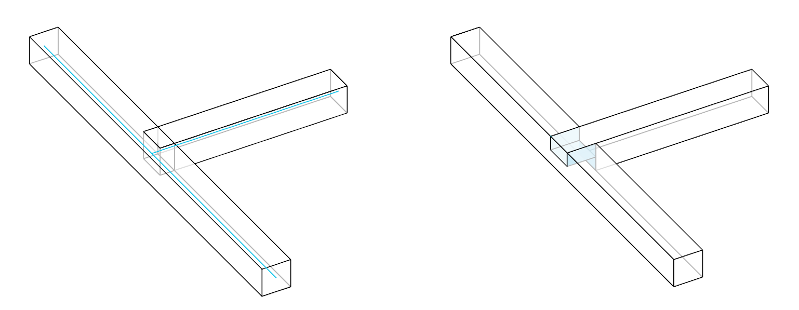

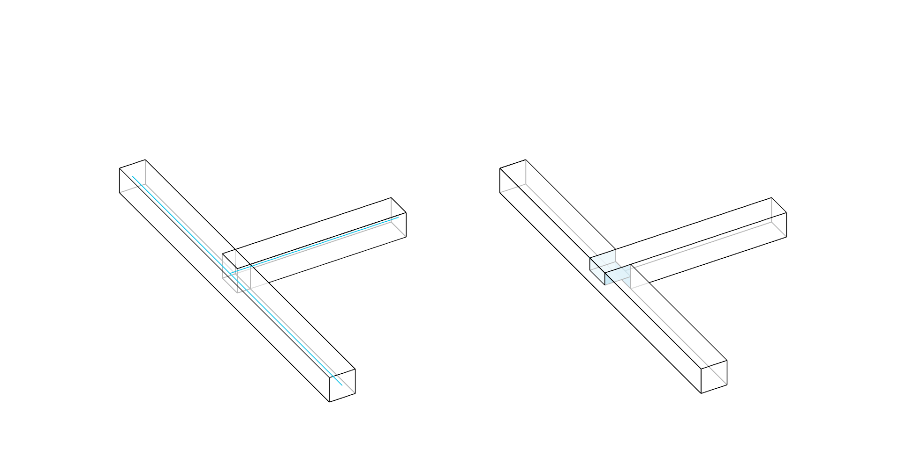

:code:`T-Half Lap` component

Inputs:

* `FlipLapSide` : Flips the lap side.
* `CutPlaneBias` : Determines the depth of lap cuts on the beams.

|

Joints for *X* Topologies
^^^^^^^

The *X* topology is when two beams cross each other along their length.
For a *X* topology, several types of joint can be applied. One of these are implemented in the current version of the COMPAS Timber: *T-Butt* and *T-Half Lap*.

|

**X-Half Lap** joint

The X-Half Lap joint removes the upper half of the overlap from one beam and the lower half from the other.

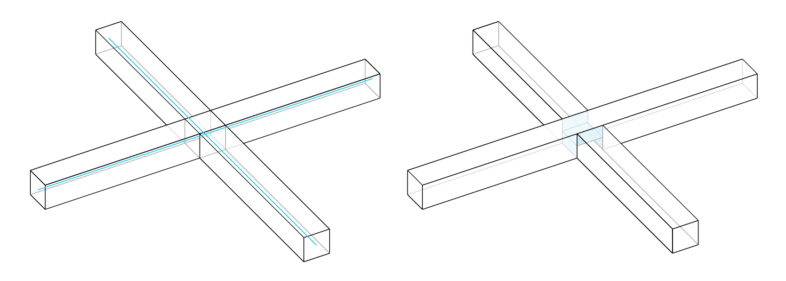

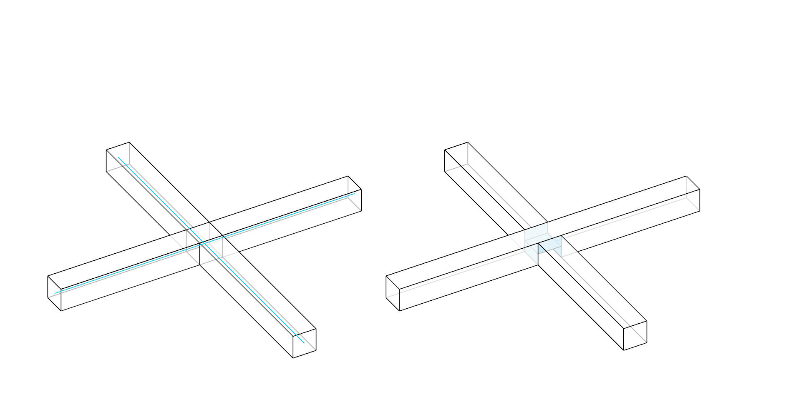

:code:`X-HalfLap Options` component

Inputs:

* `FlipLapSide` : Flips the lap side.
* `CutPlaneBias` : Determines the depth of lap cuts on the beams.

|
|

**Null Joint** joint

The NullJoint is to be used in situations where no joint is to be applied. This function can also help to create and control complex joints with more than 3 beams, or with specific categories
(in combination with a :doc:`rules` component).

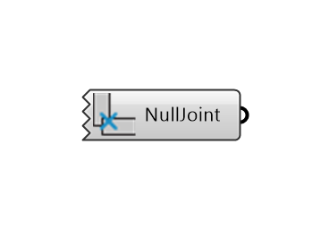

:code:`Null Joint` component

|

Summary Table
----------------

The following table summarises the joint types that can be applied to the different joint topologies.

.. list-table:: Joint Topologies and Joint Types
   :widths: 20 10 10 10
   :header-rows: 1
   :stub-columns: 1

   * -
     - L Topology
     - T Topology
     - X Topology
   * - Butt Joints
     - x
     - x
     -
   * - Miter Joints
     - x
     -
     -
   * - Half Lap Joints
     - x
     - x
     - x
   * - French Ridge Lap joints
     - x
     -
     -

|

.. note::
    Output

    The joint output is to be connected to the :code:`Assembly` component to visualise and generate the geometry of the final assembly of the beams, with their joints.
