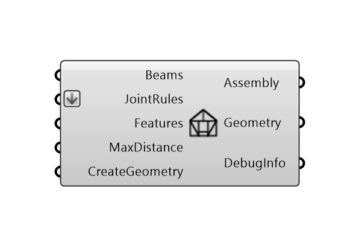

*****
Model
*****

**Assembly** component creates a structure composed of joined :code:`Beam` objects. It connects the beams with joints and adds
features based on the :doc:`joint_rules` and :doc:`features` inputs provided.

Geometric operations like cutting, trimming and solid boolean subtractions, which are implied by joints and features,
may be computationally expensive, and are disabled by default.
To activate it, set `CreateGeometry` to :code:`True`.

Inputs:

*	`Beams` : collection of beams.
*	`JointsRules` : collection of joint rules.
*	`Features` : collection of features definitions.
*	`MaxDist` : Max Distance Tolerance for topology detection.
*	`CreateGeometry` : If True, Beam and joint geometry is created for visualisation. Default is False.

Outputs

*	`Assembly` : Assembly object.
*	`Geometry` : Geometry of the beams and joints.
*   `DebugInfo` : Debug information object in the case of feature or joining errors.

|

.. note::

    **Visualisation**

    Assembly as such is an abstract object. To visualise the beams in the assembly, the :code:`ShowAssembly` component returns a *Brep* geometry of the beams. See :doc:`show` for the visualisation  of other helpful
    information such as *Joint Type* or *Beam Index*, spatially located.

    For debugging, the :code:`ShowFeatureErrors` component or :code:`ShowJoiningErrors` component visualise the errors that occur during the assembly process. See :doc:`show`.

