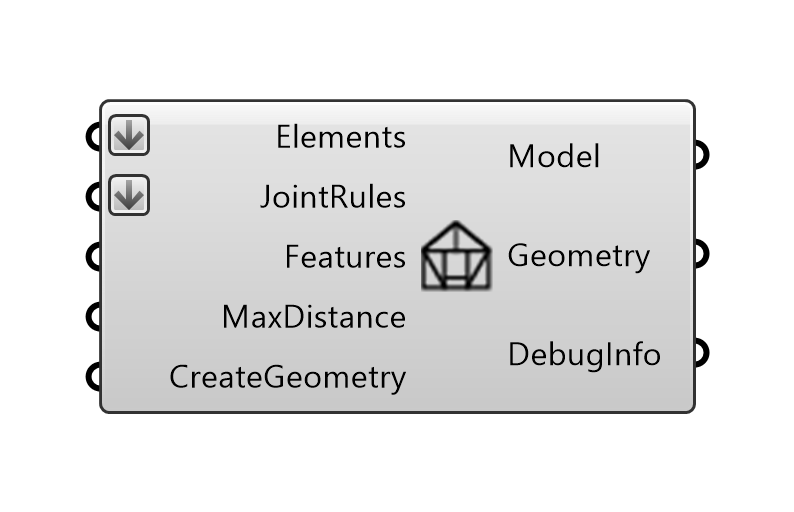

*****
Model
*****

The **Model** component creates a structure composed of joined :code:`Beam` objects. It connects the Beams with Joints and adds
features based on the :doc:`joint_rules` and :doc:`features` inputs provided.

Geometric operations like cutting, trimming and solid boolean subtractions, which are implied by joints and features,
may be computationally expensive, and are disabled by default.
To activate it, set `CreateGeometry` to :code:`True`.

Inputs:

*	`Elements` : collection of Beams or Plates.
*	`JointRules` : collection of Joint Rules.
*	`Features` : collection of features definitions.
*	`MaxDistance` : Max Distance Tolerance for topology detection.
*	`CreateGeometry` : If True, Beam and joint geometry is created for visualisation. Default is False.

Outputs

*	`Model` : Model object.
*	`Geometry` : Geometry of the Beams and Joints.
*   `DebugInfo` : Debug information object in the case of feature or joining errors.

|

