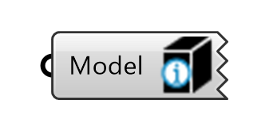
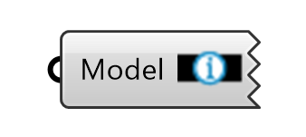
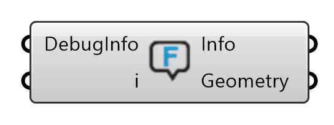
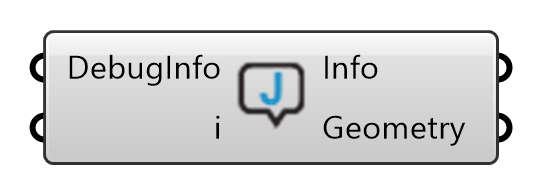
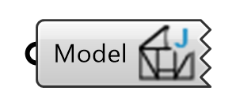
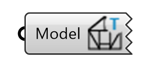

# Show

Tools forpreviewing, inspecting and extracting geometry and data from the assembly.

## Show Beam Face Index

{ width=20% }

Displays the indexes of the Beams. Based on a global list of the Beams in the assembly.

## Show Beam Index

{ width=20% }

Displays the indexes of the Beam faces.

## Show Surface Model Beam Types

Displays all Beams of one selected type from the surface model.

## Show Feature Errors

{ width=25% }

Shows information useful for debugging feature application errors.

## Show Joining Errors

{ width=25% }

Shows information useful for debugging errors occured while attempting to join Beams.

## Show Joint Types

{ width=20% }

Displays the type names of each joints in the assembly.

## Show Topology Types

{ width=20% }

Displays the topologies (L, T or X) that Compas Timber recognizes at each Joint
