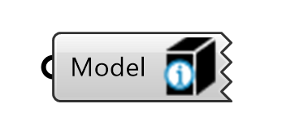
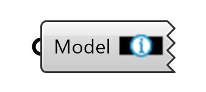
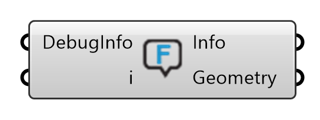
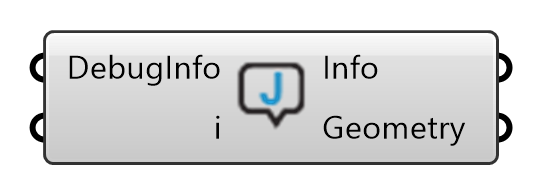
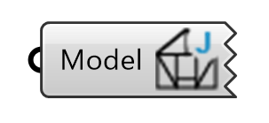

****
Show
****

Tools for previewing, inspecting and extracting geometry and data from the assembly.

Show Beam Face Index
********************

Displays the index of the beams. Based on a global list of the beams in the assembly.

Show Beam Index
***************

Displays the faces of the beams.

Show Surface Model Beam Types
*****************************

Displays Beam types in the surface model.

Show Feature Errors
*******************

Shows information useful for debugging feature application errors.

Show Joining Errors
*******************

Shows information useful for debugging errors occured while attempting to join beams.

Show Joint Types
****************

Displays the type names of each joints in the assembly.

Show Topology Types
*******************
.. image:: ../images/gh_show_topology_types.png
    :width: 20%

Displays the type names of each joints in the assembly.

