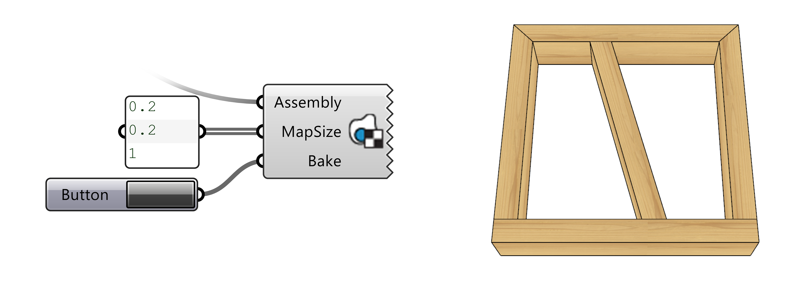

# Utils

## Bake with BoxMap

**BakeWithBoxMap** is a utility tool for rendering with texture mapping.
It bakes the *Brep* geometry of a beams
and automatically adds a beam-aligned BoxMap information to the baked objects in the Rhino document.
The objects are baked to the active layer and by default use the layer material,
i.e. the material with the desired texture mapping has to be assigned to the layer.

The BoxMap orientation is defined by a plane, where:

*   plane's x-axis corresponds to the beam's z-axis, with some random deviation
*   plane's y-axis corresponds to the beam's y-axis, with some random deviation
*   plane's origin lies at a random point on the beam's centerline

`MapSize` parameter serve to scale the BoxMap to adjusted it to size of the beam objects and image ratio of the texturing bitmap.

For documentation on BoxMapping in Rhino see [here](https://developer.rhino3d.com/api/rhinocommon/rhino.render.texturemapping/createboxmapping).

{ width=80% }
