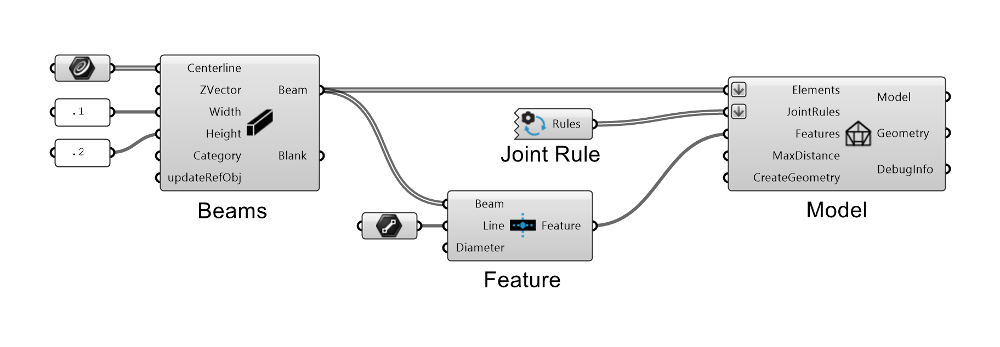

# Workflow

To build a timber frame [Model](model.md) in Grasshopper, you need to:

*   create [beams](beams.md).
*   define [joint_rules](joint_rules.md) for the interactions between the Beams. 
*   optional: define other [features](features.md).

Based on this, the [model](model.md) component takes care of generating the final geometry of the structure.

{ width=45% }

---

**Example:**

{ width=75% }

---

!!! note "Important!"

    * You can add any number of [joint_rules](joint_rules.md), but there is a hierarchy of how they are applied:
    * There are three Types of **Joint Rules** 1. By **Topology**, 2. by **Category** and 3. **Direct** Joints. Direct Joints will overwrite Category Rules, Category Rules will overwrite Topology Rules.
    * The **Joints** are processed first, then **Features**.
