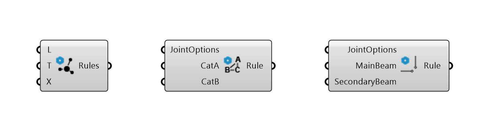

********
Workflow
********

To build a timber frame **Assembly**, you need to:

*   create **Beams**
*   define **Joints** between these beams
*   define other **Features** (optional)

Based on this, **Assembly** takes care of generating the final geometry of the structure.

.. image:: ../images/workflow_diagramm.png
    :width: 50%

|
|

**Example:**

.. image:: ../images/workflow_gh_example.png
    :width: 75%

|

.. note::

    **Important!**

    * The order in the list of **Joints** and **Features** matters! For example: if there are two different joints defined for the same pair of beams in the list, the last one will be applied (overrides entries earlier in the list).
    * The **Joints** are processed first, then **Features**.

|
|
|
Joint Rules (new):
----------------

|
The joints between beams are defined by rules. There are three different levels of rules, where each of them overrides any lower-priority rule. The ru are listed hereafter from lowest to highest level of priority:

1. **Topological Joint Rules** - the lowest-priority-level rule, applied on the entire assembly. It automatically recognises the joint topology (L, T or X) between each beam and applies joint type the corresponding the joint topology. See also :doc:`joints`

   Inputs:

   * `L` - joint type to be applied to L topology. Default type is L-Miter.
   * `T` - joint type to be applied to T topology. Default type is T-Butt.
   * `X` - joint type to be applied to X topology. Default type is X-HalfLap.
|
2. **Category Joint Rules** - the second level, defines a single joint type for a specific topology between two categories of beams. The categories are assigned through the string-input `Category` in the component :code:`Beam` and added to the rhino lines.

   Inputs:

   * `JointOptions` - joint type to be applied to a combination of specific categories of beams.
   * `CatA` - category of the first beam.
   * `CatB` - category of the second beam.
|
3. **Direct Joint Rules** - the highest level, assigns a joint type directly to specific beams. The beams can be selected using the component :code:`Find Beam By Rhino GUID` See also :doc:`beam`.

   Inputs:

   * `JointOptions` - joint type to be applied to a combination of specific categories of beams.
   * `MainBeam` - first beam.
   * `SecondaryBeam` - second beam.
|
.. note::

    Each rule overrides any lower rule, i.e., `Direct Joint Rules` override `Category Joint Rules` as well as `Topological Joint Rules`. `Category Joint Rules` override `Topological Joint Rules`.

