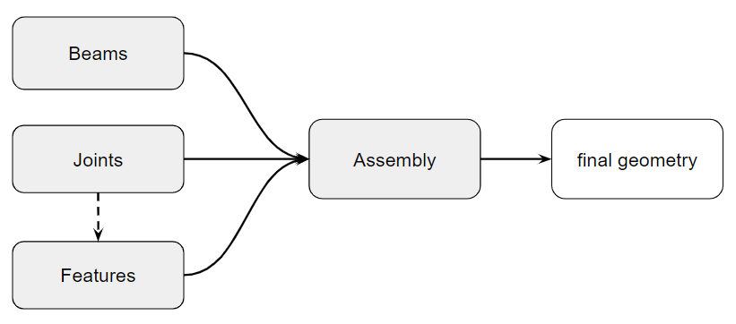
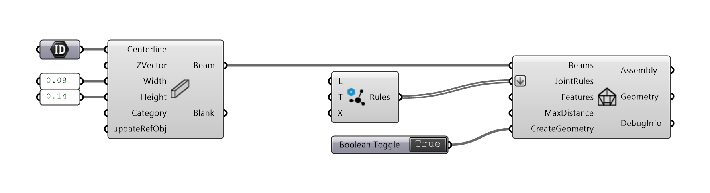

********
Workflow
********

To build a timber frame **Assembly**, you need to:

*   create **Beams**
*   define **Joints** between these beams and **Rules** how the joints are applied.
*   define other **Features** (optional)

Based on this, **Assembly** takes care of generating the final geometry of the structure.

|
|

**Example:**

|

.. note::

    **Important!**

    * There are three Types of **Joint Rules** 1. By **Topology**, 2. by **Category** and 3. **Direct** Joints. In this order, they will be applied to the Assembly. Direct Joints will overwrite Category Rules, Category Rules will overwrite Topology Rules. See :doc:`rules`.
    * The **Joints** are processed first, then **Features**.

