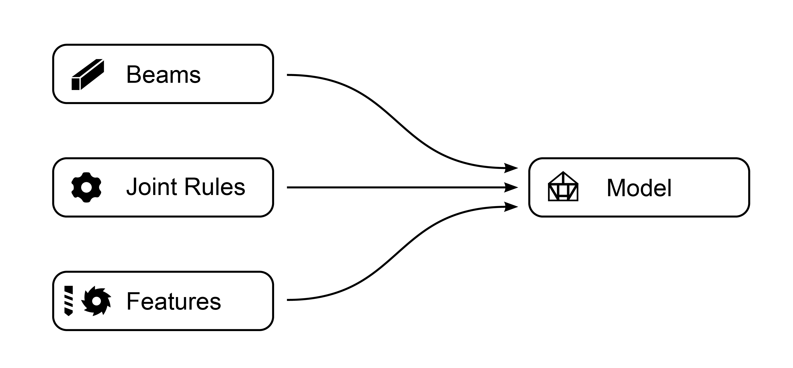

********
Workflow
********

To build a timber frame **Model** in Grasshopper, you need to:

*   create :doc:`beams`.
*   define :doc:`joint_rules` for the interactions between the Beams. 
*   optional: define other :doc:`features`.

Based on this, the :doc:`model` component takes care of generating the final geometry of the structure.

|

**Example:**

.. image:: ../images/gh_workflow_example.png
    :width: 75%

|

.. note::

    **Important!**

    * You can add any number of :doc:`joint_rules`, but there is a hierarchy of how they are applied:
    * There are three Types of **Joint Rules** 1. By **Topology**, 2. by **Category** and 3. **Direct** Joints. Direct Joints will overwrite Category Rules, Category Rules will overwrite Topology Rules.
    * The **Joints** are processed first, then **Features**.

