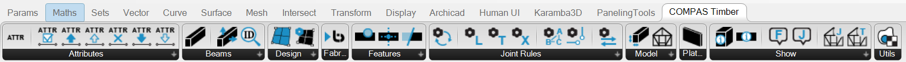

# Grasshopper plugin

**COMPAS Timber for Grasshopper** is an easy-to-use tool to design timber frame structures from simple centerline input.
It provides tools to automate the process of creating timber frame structures with simple joints,
*bake* the geometry with fibre-aligned box-mapping for texturing/rendering,
add boolean-style features like planar cuts or holes,
and some more.

The plugin is built on top of the COMPAS Timber python library and provides additional functionalities that might be useful for design in Grasshopper.

{ width=100% }

!!! note

    You can also use the COMPAS Timber python library in Grasshopper using the ghPython componenent.
    See COMPAS Timber [API Reference](../api/compas_timber.model.md) for more details.

To get an overall idea how to use it, start with [Workflow](grasshopper/workflow.md).
Then, the following sections explain in detail the concepts and tools:
